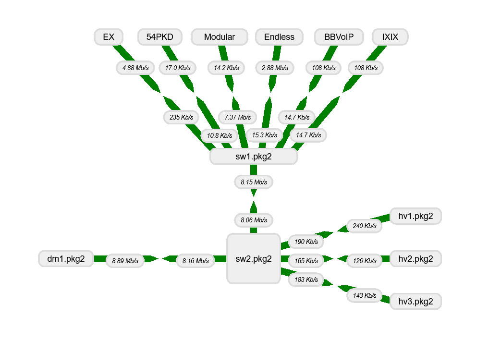

<div align="center">


# Network Weathermap NG

**Draw your network. Watch it breathe.**

Live network weathermaps for Grafana — nodes, links, and color scales driven by your real metrics.

[](https://github.com/allamiro/grafana-network-weathermap-ng/releases/latest)
[](https://github.com/allamiro/grafana-network-weathermap-ng/actions/workflows/test.yml)
[](https://github.com/allamiro/grafana-network-weathermap-ng/actions/workflows/e2e.yml)
[](LICENSE)
[](https://grafana.com/)
[](https://grafana.com/legal/plugins/)

[**Documentation**](https://allamiro.github.io/grafana-network-weathermap-ng/) ·
[**Getting Started**](https://allamiro.github.io/grafana-network-weathermap-ng/guide/getting-started/) ·
[**Use Cases**](https://allamiro.github.io/grafana-network-weathermap-ng/guide/use-cases/) ·
[**Icon Reference**](https://allamiro.github.io/grafana-network-weathermap-ng/icons/) ·
[**FAQ**](https://allamiro.github.io/grafana-network-weathermap-ng/faq/)



</div>

> A continuation of the archived [knightss27-weathermap-panel](https://github.com/knightss27/grafana-network-weathermap),
> rebuilt for modern Grafana — React 18, Grafana 11→13, TypeScript 5, and a hardened, regression-tested core.

---

## ✨ What it does

<table>
<tr>
<td width="33%" valign="top">

**🗺️ Maps, not charts**<br>
Lay out nodes and links to match your real topology — WAN, datacenter, campus, rack, or global backbone on a world map.

</td>
<td width="33%" valign="top">

**🌡️ Metrics as color**<br>
Links and nodes recolor live from any Grafana data source — Prometheus, InfluxDB, Zabbix, anything that returns a series.

</td>
<td width="33%" valign="top">

**⏪ Incident replay**<br>
Scrub the built-in timeline and watch link utilization *and* node status replay history, step by step.

</td>
</tr>
<tr>
<td valign="top">

**🎛️ Everything in-panel**<br>
Nodes, links, VIAs, thresholds, tooltips, drill-down dashboard links — all edited inside Grafana, no external tools.

</td>
<td valign="top">

**🧭 PHP Weathermap familiar**<br>
Classic weathermap design language, so teams migrating from the old tooling feel at home immediately.

</td>
<td valign="top">

**🖼️ 1064 bundled icons**<br>
Twelve icon sets served by the plugin itself — no external image hosting, air-gap friendly.

</td>
</tr>
</table>

## 🖼️ Gallery

<table>
<tr>
<td align="center" width="50%">
<a href="https://allamiro.github.io/grafana-network-weathermap-ng/guide/use-cases/#11-rack-cabling-power-redundancy-multi-device-rear-view">
<br>
<sub><b>Rack cabling & power redundancy</b></sub>
</a>
</td>
<td align="center" width="50%">
<a href="https://allamiro.github.io/grafana-network-weathermap-ng/guide/use-cases/#9-global-backbone-on-a-world-map">
<br>
<sub><b>Global backbone on a world map</b></sub>
</a>
</td>
</tr>
<tr>
<td align="center">
<a href="https://allamiro.github.io/grafana-network-weathermap-ng/guide/use-cases/#3-incident-retrospective-timeline-replay">
<br>
<sub><b>Incident replay (timeline slider)</b></sub>
</a>
</td>
<td align="center">
<a href="https://allamiro.github.io/grafana-network-weathermap-ng/guide/use-cases/#6-device-health-overview-status-coloring">
<br>
<sub><b>Device health & status coloring</b></sub>
</a>
</td>
</tr>
</table>

<div align="center">
<sub>Eleven ready-made scenarios — each with a recipe and a runnable demo dashboard — in the
<a href="https://allamiro.github.io/grafana-network-weathermap-ng/guide/use-cases/"><b>Use Cases guide</b></a>.</sub>
</div>

## 🧩 The icon library

<div align="center">

&nbsp;
&nbsp;
&nbsp;
&nbsp;
&nbsp;
&nbsp;
&nbsp;
&nbsp;
&nbsp;
&nbsp;
&nbsp;


**1064 icons · 12 sets** — every one served by the plugin itself


<sub>Browse them all in the <a href="https://allamiro.github.io/grafana-network-weathermap-ng/icons/"><b>Icon Reference</b></a>.
Need the official AWS/Azure/GCP architecture packs? <code>scripts/fetch-cloud-icons.sh</code> installs them onto your own Grafana.</sub>

</div>

## 🚀 Quick start

**Install (from within Grafana):**

1. Go to <kbd>Administration</kbd> → <kbd>Plugins and data</kbd> → <kbd>Plugins</kbd>
2. Search for **Network Weathermap NG** and click <kbd>Install</kbd>

**Build your first map:**

1. <kbd>Add panel</kbd> → pick **Network Weathermap NG** as the visualization
2. Open the **Map Editor** in the panel options
3. Add nodes, draw links between them, bind each link side to a query
4. Set your color-scale thresholds — the map starts breathing 🌡️

### 📦 Manual install (signed release zip)

Grab the versioned zip from the [latest release](https://github.com/allamiro/grafana-network-weathermap-ng/releases/latest), then:

```bash
unzip tamirsuliman-weathermap-panel-*.zip -d /var/lib/grafana/plugins/
systemctl restart grafana-server
```

Every release ships a `.zip.sha1` checksum, a community signature (`MANIFEST.txt`), and a GitHub build-provenance attestation.

### 🐳 Local environments — know which one you want

The repo ships **two** Docker Compose environments with different jobs:

| | 🛠️ Dev server | 🐳 Demo & E2E playground |
|---|---|---|
| **Start** | `npm run server` *(repo root)* | `cd testing && docker compose up --build` |
| **URL** | `http://localhost:3000` — admin / admin | `http://localhost:3101` — anonymous admin |
| **Contains** | your local `dist/` build + root `provisioning/` | plugin + Prometheus + simulated-WAN exporter + **all demo dashboards** |
| **Use it for** | plugin development (pair with `npm run dev` watch mode) | trying every use case, plugin review, `npm run e2e:local` |
| **Pin Grafana** | `GRAFANA_VERSION=11.0.0 npm run server` | `GRAFANA_VERSION=11.0.0 docker compose up --build` |

The playground provisions WAN utilization, incident replay, rack boards, the world-map backbone, and more — every scenario from the [Use Cases guide](https://allamiro.github.io/grafana-network-weathermap-ng/guide/use-cases/), ready to click through.

|  | Requirement | Version |
|:-:|---|---|
| 📊 | **Grafana** | **11.0.0+** — tested through 13.x |
| ⚙️ | **Node.js** *(development only)* | 20 – 24 (`.nvmrc` pins 24) |

## 🛡️ Built to not break

This fork treats reliability as a feature. Beyond unit coverage, the suite is built around *regression traps* for the bugs that bite weathermaps in production:

- **Hostile-data safe** — malformed or partial saved options, links pointing at deleted nodes, empty data frames, overlapping nodes: the panel renders instead of crashing, guaranteed by tests.
- **Immutable by construction** — every editor interaction delivers new state; the test harnesses deep-freeze the options object so any in-place mutation fails CI instantly.
- **Playwright E2E** on real Grafana (declared minimum *and* latest) — weekly, on demand, and on every PR that touches the E2E surface.
- **Release discipline** — packaging layout checks on PRs, API-compatibility gates for Grafana 11→13, signed artifacts with checksums and provenance attestation.

### 🔄 What was modernized from the original

| Area | | Change |
|---|:-:|---|
| **Grafana SDK** |  | `@grafana/data` / `runtime` / `ui` updated and verified against Grafana 13 |
| **React** |  | React 19 / `findDOMNode` crash fixed |
| **TypeScript** |  | all `@ts-ignore` overrides removed |
| **Styling** |  | `stylesFactory` → `useStyles2` + `@emotion/css` |
| **Security** |  | URL sanitization for dashboard links, icons, and background images |
| **E2E** |  | deprecated `@grafana/e2e` → `@grafana/plugin-e2e` |
| **CI/CD** |  | signed releases, provenance attestation, docs site, API-compat matrix, packaging checks |

## 🤝 Contributing

Issues and PRs are welcome — please open an issue first for significant changes.

| | |
|:-:|---|
| 🐛 | [**Report a bug**](https://github.com/allamiro/grafana-network-weathermap-ng/issues/new?template=bug_report.yml) — crashes, wrong rendering, editor glitches |
| ✨ | [**Request a feature**](https://github.com/allamiro/grafana-network-weathermap-ng/issues/new?template=feature_request.yml) — new icon sets, options, integrations |
| 🛠️ | [**Development guide**](CONTRIBUTING.md) — local setup, build, and test commands |
| 💬 | [**Browse open issues**](https://github.com/allamiro/grafana-network-weathermap-ng/issues) — see what's planned or grab something to work on |

## 🧾 Credits & license

Created and maintained by **[Tamir Suliman](https://github.com/allamiro)** ([allamiro@gmail.com](mailto:allamiro@gmail.com)).
A continuation of the archived [knightss27-weathermap-panel](https://github.com/knightss27/grafana-network-weathermap) — thank you to its original author.

Icon sets bundled under their respective licenses (Simple Icons CC0, devicon MIT, circle-flags MIT, flag-icons MIT) — see [NOTICE](NOTICE). Product names and logos are trademarks of their owners, used for identification only.

**Apache-2.0** — see [LICENSE](LICENSE). Redistributions must retain the [NOTICE](NOTICE) attribution per Apache-2.0 §4(d).

## 📖 Citing

If you use this project in research or publications, please cite it — GitHub's **"Cite this repository"** button (powered by [CITATION.cff](CITATION.cff)) provides APA and BibTeX entries:

```bibtex
@software{Suliman_Network_Weathermap_NG,
  author  = {Suliman, Tamir},
  title   = {Network Weathermap NG},
  url     = {https://github.com/allamiro/grafana-network-weathermap-ng},
  license = {Apache-2.0}
}
```

<div align="center">
<sub>⭐ If this plugin lights up your NOC wall, a star helps others find it.</sub>
</div>
