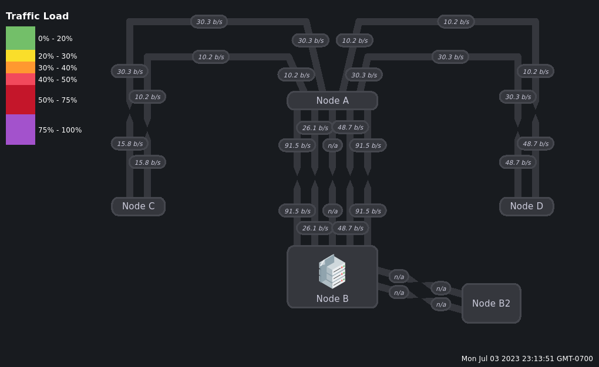
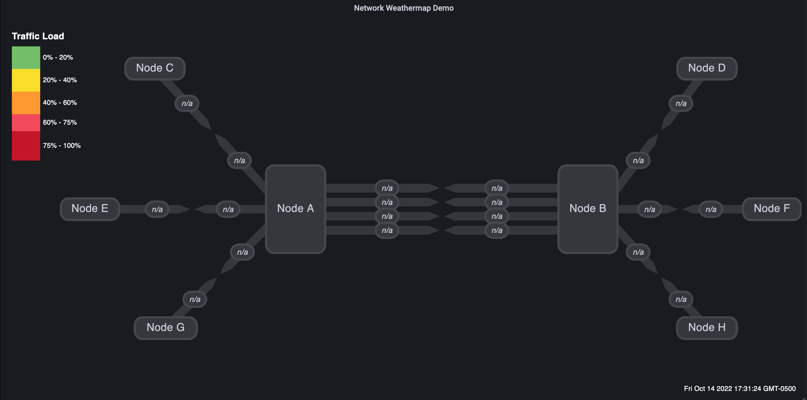

<div align="center">
  

  # Network Weathermap NG

  **A modernized, actively maintained network weathermap panel plugin for Grafana**

  [](https://opensource.org/licenses/Apache-2.0)
  [](https://grafana.com/)
  [](https://github.com/allamiro/grafana-network-weathermap-ng/blob/main/CONTRIBUTING.md)

  This is a continuation of the original [knightss27-weathermap-panel](https://github.com/knightss27/grafana-network-weathermap), updated for modern Grafana environments.
</div>

---

## Features

- **Customizable network weathermaps** — draw nodes, links, and color scales that match your infrastructure layout
- **Real-time data visualization** — dynamic link and node coloring based on live Grafana metrics
- **PHP Network Weathermap compatibility** — familiar design patterns for teams migrating from classic tools
- **Multi-source support** — works with Prometheus, InfluxDB, Zabbix, and any Grafana-compatible data source
- **Intuitive panel editor** — build and modify maps entirely within the Grafana UI, no external tools required

---

## Use Cases

The **[step-by-step Use Cases guide](https://allamiro.github.io/grafana-network-weathermap-ng/guide/use-cases/)** is the fastest way to get started — eleven ready-made scenarios, each with a live screenshot, a recipe, and a demo dashboard you can run locally (`cd testing && docker compose up --build`):

1. [WAN link utilization](https://allamiro.github.io/grafana-network-weathermap-ng/guide/use-cases/#1-wan-link-utilization-two-sites) · 2. [Capacity planning (p95)](https://allamiro.github.io/grafana-network-weathermap-ng/guide/use-cases/#2-capacity-planning-avg-95th-percentile) · 3. [Incident replay (timeline)](https://allamiro.github.io/grafana-network-weathermap-ng/guide/use-cases/#3-incident-retrospective-timeline-replay) · 4. [Floor plan background](https://allamiro.github.io/grafana-network-weathermap-ng/guide/use-cases/#4-data-center-floor-plan-background-follows-the-map) · 5. [Multi-hop VIAs](https://allamiro.github.io/grafana-network-weathermap-ng/guide/use-cases/#5-multi-hop-path-with-vias) · 6. [Device health](https://allamiro.github.io/grafana-network-weathermap-ng/guide/use-cases/#6-device-health-overview-status-coloring) · 7. [Parallel links / LAG](https://allamiro.github.io/grafana-network-weathermap-ng/guide/use-cases/#7-parallel-links-between-the-same-nodes) · 8. [Clickable drill-down](https://allamiro.github.io/grafana-network-weathermap-ng/guide/use-cases/#8-clickable-drill-down-map) · 9. [Global backbone on a world map](https://allamiro.github.io/grafana-network-weathermap-ng/guide/use-cases/#9-global-backbone-on-a-world-map) · 10. [Rack port status board](https://allamiro.github.io/grafana-network-weathermap-ng/guide/use-cases/#10-rack-switch-port-status-board) · 11. [Rack cabling & power redundancy](https://allamiro.github.io/grafana-network-weathermap-ng/guide/use-cases/#11-rack-cabling-power-redundancy-multi-device-rear-view)

<p align="center">
  <a href="https://allamiro.github.io/grafana-network-weathermap-ng/guide/use-cases/">
    
    
  </a>
</p>

See also the **[Icon Reference](https://allamiro.github.io/grafana-network-weathermap-ng/icons/)** — nearly 1,000 bundled icons across network devices, rack parts, country flags, platforms, programming languages, and aerospace sets.

---

## Screenshots

<p align="center">
  
</p>

<p align="center">
  
  
</p>

---

## Getting Started

### Requirements

| Requirement | Minimum Version |
|---|---|
| Grafana | 11.0.0 |
| Node.js | 20.x |

### Installation

**Option 1 — Grafana Marketplace (recommended)**

1. In Grafana, go to **Administration → Plugins → Find more plugins**
2. Search for **Network Weathermap**
3. Click **Install**

**Option 2 — Manual**

```bash
# Download the latest release
curl -LO https://github.com/allamiro/grafana-network-weathermap-ng/releases/latest/download/tamirsuliman-weathermap-panel.zip

# Extract to your Grafana plugins directory
unzip tamirsuliman-weathermap-panel.zip -d /var/lib/grafana/plugins/

# Restart Grafana
systemctl restart grafana-server
```

### Quick Start

1. Create or open a dashboard
2. **Add panel** → search for **Network Weathermap**
3. Connect a data source (Prometheus, InfluxDB, etc.)
4. Use the **Map Editor** tab to add nodes and links
5. Assign metrics to links and configure color thresholds
6. Save the dashboard

---

## Development

For local setup, build commands, Docker environment, and contribution guidelines, see [CONTRIBUTING.md](https://github.com/allamiro/grafana-network-weathermap-ng/blob/main/CONTRIBUTING.md).

---

## Modernization

This plugin modernizes the archived original for current Grafana versions:

| Area | Change |
|---|---|
| Grafana SDK | Updated `@grafana/data`, `@grafana/runtime`, `@grafana/ui` to 11.x |
| Grafana dependency | Minimum version set to **11.0.0** |
| React | Upgraded from React 17 to **React 18** |
| Node.js | Minimum version raised to **20** |
| TypeScript | Upgraded to **TypeScript 5.4+** |
| Styling | Migrated from `stylesFactory` to `useStyles2` and `@emotion/css` |
| Type safety | Removed all `@ts-ignore` overrides; added proper types throughout |
| Deprecated APIs | Replaced `Vector.get()` with direct array indexing |
| E2E testing | Migrated from deprecated `@grafana/e2e` to `@grafana/plugin-e2e` (Playwright) |
| CI/CD | Added release workflow, GitHub Pages docs, and Grafana API compatibility checks |

---

## Contributing

Contributions are welcome. Please open an issue first to discuss significant changes.

- [Report a bug](https://github.com/allamiro/grafana-network-weathermap-ng/issues/new?template=bug_report.md)
- [Request a feature](https://github.com/allamiro/grafana-network-weathermap-ng/issues/new?template=feature_request.md)
- [Browse open issues](https://github.com/allamiro/grafana-network-weathermap-ng/issues)

---

## Author

**Tamir Suliman** — [allamiro@gmail.com](mailto:allamiro@gmail.com) — [GitHub](https://github.com/allamiro)

## Citing

If you use this project in research or publications, please cite it — GitHub's
**"Cite this repository"** button (powered by [CITATION.cff](CITATION.cff)) provides
APA and BibTeX entries, e.g.:

```bibtex
@software{Suliman_Network_Weathermap_NG,
  author  = {Suliman, Tamir},
  title   = {Network Weathermap NG},
  url     = {https://github.com/allamiro/grafana-network-weathermap-ng},
  license = {Apache-2.0}
}
```

## License

Apache-2.0 — see [LICENSE](https://github.com/allamiro/grafana-network-weathermap-ng/blob/main/LICENSE) and [NOTICE](https://github.com/allamiro/grafana-network-weathermap-ng/blob/main/NOTICE) for details. Redistributions must retain the attribution in the NOTICE file per Apache-2.0 §4(d).
