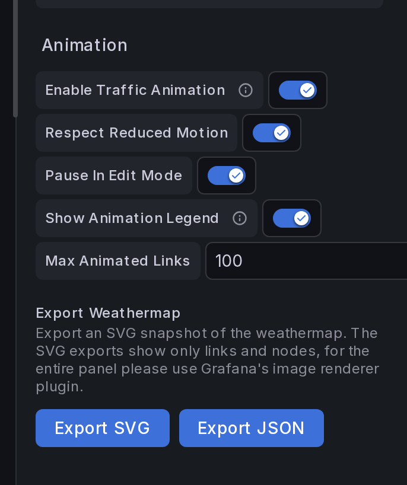

# Traffic Animation (Animated Links)

Network Weathermap NG can animate small **moving dots** along a link to show traffic **direction** and **intensity** at a glance — a firewall pushing traffic to a core switch reads as a stream of dots flowing that way, faster and denser as the link fills up.


*The WAN Demo — Animated Traffic Flow dashboard: dots stream in both directions on each active trunk; speed and density follow utilization; the CORE-A ↔ CORE-B pair shows a down trunk with static ✕ badges and DOWN labels instead of motion.*

!!! warning "This is a visualization, not packet capture"
    The dots are **symbolic**. They are derived from the numeric metrics your Grafana queries already return (bits/sec, utilization %). They do **not** represent individual real packets, and the plugin does **not** capture, inspect, or replay traffic. There is no tcpdump, PCAP, DPI, NetFlow/sFlow/IPFIX collector, or custom data source involved — it only animates values Grafana hands it. See [Scope boundaries](#scope-and-non-goals).

Animation is **disabled by default**. Existing dashboards render exactly as before until you turn it on.

---

## Where the numbers come from

Animation reuses the **same A-side / Z-side values that already color your links** — no new queries are required. A common, clean path for interface counters is SNMP → Prometheus:

```
 Switch / Router / Firewall
   → SNMP (ifHCInOctets / ifHCOutOctets / ifOperStatus …)
     → snmp_exporter (if_mib module)
       → Prometheus  (stores the time series)
         → Grafana query  (rate(...) * 8  → bits/sec)
           → Network Weathermap NG  → animated dots on the link
```

The same idea works with any source that returns numeric time series:

| Environment | Collection path |
|---|---|
| Network devices | SNMP → `snmp_exporter` → Prometheus |
| Linux servers | `node_exporter` → Prometheus |
| Zabbix | Zabbix item → Grafana Zabbix data source |
| InfluxDB | Telegraf SNMP input → InfluxDB |

!!! note "Metric availability depends on your device"
    SNMP interface metrics require the `snmp_exporter` **if_mib** module or equivalent. Exact counters (`ifHCOutOctets`, `ifOperStatus`, `ifOutErrors`, …) depend on the device and SNMP configuration.

### Example PromQL

The MVP drives animation from a bits/sec value on each side plus the side bandwidth.

```promql
# A → Z bits/sec  (outbound octets from the A-side interface)
rate(ifHCOutOctets{instance="core-switch", ifName="Gi1/0/1"}[2m]) * 8

# Z → A bits/sec  (outbound octets from the Z-side interface)
rate(ifHCOutOctets{instance="firewall", ifName="eth1"}[2m]) * 8

# Interface status (drives the down-link ✕ treatment via the link Status Query)
ifOperStatus{instance="core-switch", ifName="Gi1/0/1"}
```

For Linux hosts, use `node_network_transmit_bytes_total` (×8 for bits) and `node_network_up`.

---

## How to make links animate

### 1. Turn on animation (panel level)

Open **Panel options → Animation**:



| Option | Default | What it does |
|---|---|---|
| **Enable Traffic Animation** | Off | Master switch. Off = nothing animates. |
| **Respect Reduced Motion** | On | AND-gated with the viewer's OS *prefers-reduced-motion*. When the OS asks for reduced motion, dots don't move. |
| **Pause In Edit Mode** | On | Stops animation while you're editing the panel, so it doesn't distract while you place nodes. |
| **Show Animation Legend** | On | Shows the built-in legend (moving dot = live traffic, ✕ = down). Rendered only while animation is active. |
| **Max Animated Links** | 100 | Hard cap on how many links animate at once, protecting large maps. |

### 2. (Optional) override per link

Each link has a **Traffic Animation** control in the [link editor](links.md#traffic-animation-per-link-override):

| Per-link value | Behavior |
|---|---|
| **Inherit** (default) | Follows the panel master switch. |
| **Enabled** | Animates this link **even when the panel switch is off** — good for spotlighting one flow. |
| **Disabled** | Never animates this link, even when the panel switch is on. |

That's it — with a side query, a bandwidth, and the switch on, the link starts flowing. To make a link animate you need **no new fields**: the A/Z values and bandwidths you already set drive everything.

---

## What the animation shows

### Direction

The plugin already models each link as two sides. Animation follows the same model:

- **A-side value > 0** → dots move **A → Z**
- **Z-side value > 0** → dots move **Z → A**
- **both > 0** → dots move both ways
- [Single-direction links](links.md#stroke-and-arrows) animate only A → Z

### Speed and density (utilization)

If a side has a **bandwidth**, the plugin computes utilization and scales the dots — *symbolically*, not per-packet:

```
utilization  = max(0, value) / bandwidth      (clamped to 0…1)
speed (px/s) = 20 + sqrt(utilization) * 100
dot count    = 1 + round(utilization * 7)
```

The `sqrt` easing keeps light traffic visible without letting a saturated link race off the screen. Rough feel:

| Utilization | Result |
|---|---|
| 0% | no dots |
| 1–10% | 1 slow dot |
| 10–40% | 2–3 dots |
| 40–70% | 4–5 dots |
| 70–90% | 6–7 dots |
| 90%+ | dense, fast, warning-colored dots |

!!! info "Bandwidth is required for scaling"
    Utilization needs a capacity. Set **A/Z Bandwidth #** (or a **Bandwidth Query**) on the link. With **no bandwidth (or zero)**, the side resolves to *no dots* rather than guessing.

### Color

By default each dot inherits the link's **threshold color** for its current utilization — so a link going yellow → orange → red carries dots of the same color. No separate configuration.

### Down links

Give a link a [**Status Query**](links.md#link-status-up-down). When it resolves *down* (value `0` or absent):

- traffic cannot flow, so the dots are replaced by **three static ✕ badges** along the link (neutral disc + down-colored ring + contrast glyph — deliberately distinct from the red end of the utilization ramp),
- both side labels read **DOWN** instead of a stale throughput number (the hover tooltip still shows the real series and its history so you can see the moment of collapse).

!!! note "The DOWN treatment is part of animation"
    The static ✕ markers **and** the DOWN labels only apply to links that participate in animation (panel switch on, or per-link *Enabled*). A map that never enables animation keeps its existing down-link rendering (dashed line + last value) unchanged.

### Legend

While animation is active, a small built-in legend explains the glyphs. It renders **only** when animation is on for the panel (or a link overrides to *Enabled*), never on a non-animated map, and it can be hidden with **Show Animation Legend**.

---

## Timeline replay

When the [Timeline Slider](panel-options.md#timeline-slider) is scrubbed into the past, **animation pauses** — the map is replaying a historical snapshot, and static values read more clearly than motion. Press **Live** to resume the flowing dots.

!!! note "MVP limitation, by design"
    Animating *historical* rates as you scrub (dots that speed up/slow down to match the replayed moment) is a planned enhancement, not a bug. Today, scrubbing = paused animation; live = flowing animation.

---

## Accessibility & performance

Animation is built to stay out of the way:

- **Reduced motion** — honored by default (AND-gated with the OS preference); no flashing, no high-frequency blinking.
- **Fully optional** — off by default, disablable globally and per link, paused in edit mode.
- **No React re-renders** — dots are native SVG `<animateMotion>` elements. The browser's compositor animates them; the panel does **not** re-render per frame and uses no `requestAnimationFrame`.
- **Bounded** — the **Max Animated Links** cap limits how many links animate at once.

---

## Scope and non-goals

This feature **only visualizes numeric metrics already returned by Grafana queries**. It intentionally does **not** implement any of:

> packet capture · tcpdump · PCAP parsing · deep packet inspection · payload inspection · NetFlow / sFlow / IPFIX collection · packet replay · a custom packet-capture agent · a custom Grafana data source

See the broader [scope boundaries](use-cases.md) for how this sits alongside the plugin's other visualization-only features.

---

## Try it live

The **WAN Demo — Animated Traffic Flow** dashboard ships with the [testing stack](https://github.com/allamiro/grafana-network-weathermap-ng/tree/main/testing#readme):

```bash
npm install && npm run build
cd testing && docker compose up --build
```

Open `http://localhost:3101` → **Dashboards** → *WAN Demo — Animated Traffic Flow*. The simulator produces low / medium / high / idle / bidirectional / down link series so every animation state is visible, including a permanently-down trunk with static ✕ badges next to an animated one.
