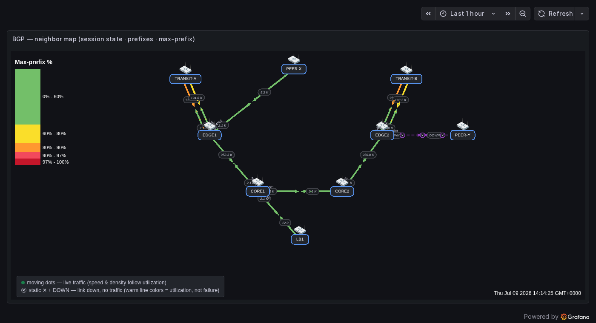
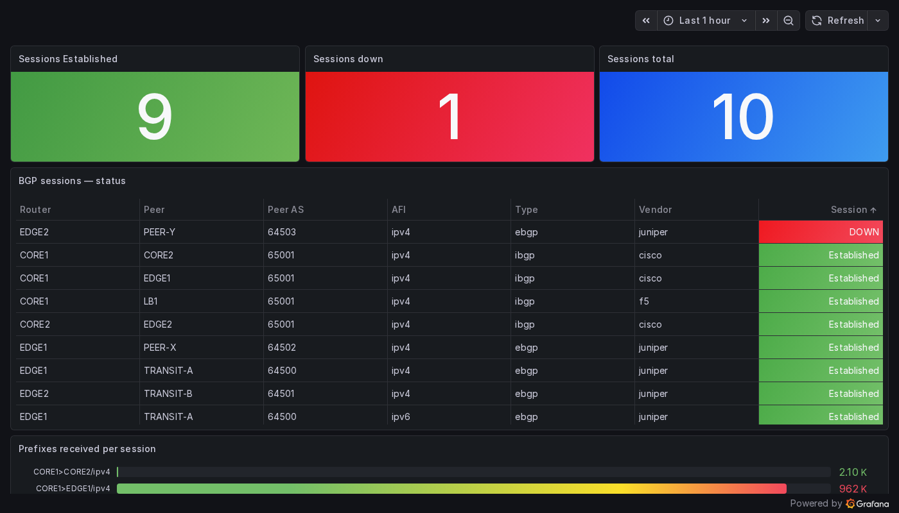

# BGP Neighbor Status

A BGP session **is** a link, and a session's **state is that link's status** — so
Network Weathermap NG maps onto BGP almost 1:1, and arguably better than raw
bandwidth. Routers (or ASes) are nodes, BGP sessions are links, and a dropped
neighbor lights up exactly like a down interface: dashed line, ✕ badges, `DOWN`
label, blink.



*The demo `WAN Demo — BGP Neighbor Map`: iBGP core (green, headroom), eBGP transits (orange — near their max-prefix limit), and a dropped eBGP peer EDGE2↔PEER-Y (purple dashed, ✕ badges, DOWN). Prefix counts label every session.*

!!! info "This is a status map, not a route collector"
    It shows **session health + prefix counts** — the "is BGP healthy" question. It does **not** collect the route table. If you need full route contents, that's a different pipeline (BMP / a peering collector) — see [collection methods](#choosing-how-to-collect).

## How BGP maps onto the weathermap

| BGP concept | Weathermap element |
|---|---|
| Router / peer / AS | **Node** (label = hostname + ASN) |
| BGP session (eBGP / iBGP) | **Link** between the two nodes |
| **Neighbor state (Established?)** | Link **Status Query** → up/green vs down (dashed + ✕ + DOWN + blink) |
| Prefixes received / advertised | A-side / Z-side **values** (label = table size) |
| Max-prefix fullness | Link **color** (set side Bandwidth = the prefix limit) |
| Peer IP / ASN, uptime, flaps, state | **Port label** / **Tooltip Extra Metrics** |
| Per-router deep dive | Node **Dashboard Link** → the session-detail dashboard |
| IPv4 vs IPv6 to the same peer | **Parallel links** (Link Offset) |

## The one gotcha: normalize the state to 1/0

The plugin treats a Status Query as **`0` or absent = down, any non-zero = up**.
BGP state metrics are **enums** — `idle=1 … established=6` — so a session in
`active` (3) would read as "up" if bound raw. Collapse it with `== bool 6`
(ideally in a Prometheus recording rule):

```promql
# Link Status Query — 1 only when Established
cbgpPeer2State{...} == bool 6            # Cisco
jnxBgpM2PeerState{...} == bool 6         # Juniper
bgpPeerState{...} == bool 6              # standard BGP4-MIB / F5
```

The [starter kit](#starter-kit) ships recording rules that produce a
vendor-neutral `bgp_session_up` (1/0) plus `bgp_prefixes_received` /
`bgp_prefixes_advertised`, so one set of dashboards works across a mixed fleet.

## Choosing how to collect

What you can see depends on **where in the router's BGP pipeline you tap** —
Adj-RIB-In (pre/post inbound policy), Loc-RIB (best paths), Adj-RIB-Out (what you
advertise). A neighbor-status map only needs session health, so use a
health-oriented tap:

| Intent | Method | For this map |
|---|---|---|
| Session health + prefix counts | **gNMI / OpenConfig** (push, structured, multi-AFI) | **Best** |
| Same, already running SNMP | **SNMP** BGP4-MIB / vendor MIB (pull) | **Simplest** |
| Full route contents (pre-policy) | **BMP** (RFC 7854) → collector → Kafka | Overkill |
| Live update feed | Peer a passive speaker (ExaBGP / GoBGP / BIRD) | Overkill |
| Snapshot / can't reconfigure | CLI scrape (NAPALM `get_bgp_neighbors`) | Works, brittle |
| Offline archive | MRT dumps (RFC 6396) | Not live |

!!! warning "Reachability"
    SNMP is pull (exporter → device UDP/161); gNMI/BMP are device → collector over TCP. Across a firewalled enclave those flows must be permitted; in an air-gapped enclave you're limited to CLI snapshots or shipping dumps out-of-band.

## Per-vendor sources (Cisco · Juniper · F5 · gNMI)

| Platform | SNMP (snmp_exporter) | gNMI / OpenConfig |
|---|---|---|
| **Cisco** IOS-XE/XR/NX-OS | `CISCO-BGP4-MIB` — `cbgpPeer2State`, `cbgpPeer2AcceptedPrefixes`, `cbgpPeer2AdvertisedPrefixes` (IPv4+IPv6) | `…/bgp/neighbors/neighbor/state/session-state`, `…/afi-safis/afi-safi/state/prefixes/received` |
| **Juniper** Junos | `BGP4-V2-MIB-JUNIPER` — `jnxBgpM2PeerState`, `jnxBgpM2PrefixInPrefixesAccepted` | same OpenConfig paths |
| **F5 BIG-IP** | standard `BGP4-MIB` — `bgpPeerState` (advanced routing / ZebOS, IPv4) | — |
| **Any (gNMI)** | — | collect with `gnmic` → Prometheus output |

The standard `BGP4-MIB` (RFC 4273) is **IPv4-unicast only** — IPv6/other AFI-SAFI
needs the vendor MIB or gNMI.

## Building the map

1. **Collect + normalize** into `bgp_session_up` / `bgp_prefixes_*` (kit rules).
2. Add a node per router; label it with the ASN.
3. Add a link per session. In the link editor:
   - **Status Query** = `bgp_session_up{node_name="…", peer="…", afi="…"}`.
   - **A Side Query** = advertised, **Z Side Query** = received.
   - **A/Z Bandwidth #** = the neighbor's **max-prefix limit** → the link warms as the peer fills its table (green → orange → red). For sessions with no limit, use a large reference so they read green.
   - **Status down color** + **blink**, and add **Tooltip Extra Metrics** for session-state / uptime / flaps.
   - **Enable Traffic Animation** on the panel so dropped sessions get the ✕ badges + `DOWN` labels (up sessions get gentle activity dots).
4. Point each node's **Dashboard Link** at your BGP session-detail dashboard.

## Fleet overview & detail

Two companion dashboards ship in the kit and work for **any** fleet with the
normalized metrics — no per-topology editing:



- **BGP Fleet Overview** — Established / down / total counters, a one-row-per-session status table (DOWN sorted to the top), and a prefixes-received bar gauge (transits near their limit turn red).
- **BGP Session Detail** — per-router state, prefixes, uptime, and flaps, reached by clicking a node on the map.

## Starter kit

Everything above — recording rules, snmp_exporter generator modules, and the
three importable dashboards — is in
[`tools/bgp/`](https://github.com/allamiro/grafana-network-weathermap-ng/tree/main/tools/bgp).
Try it live on the [testing stack](https://github.com/allamiro/grafana-network-weathermap-ng/tree/main/testing#readme):
`WAN Demo — BGP Neighbor Map`, `… BGP Fleet Overview`, `… BGP Session Detail`.
