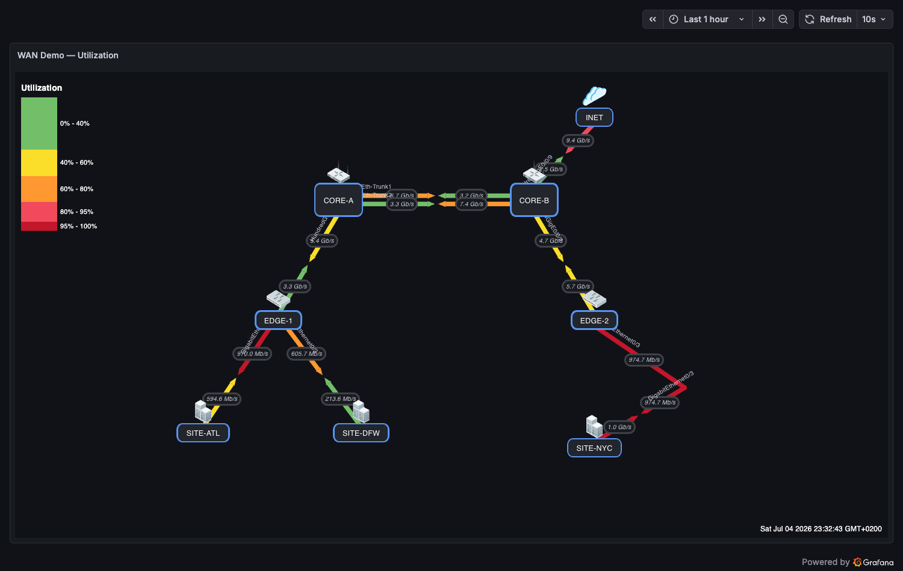
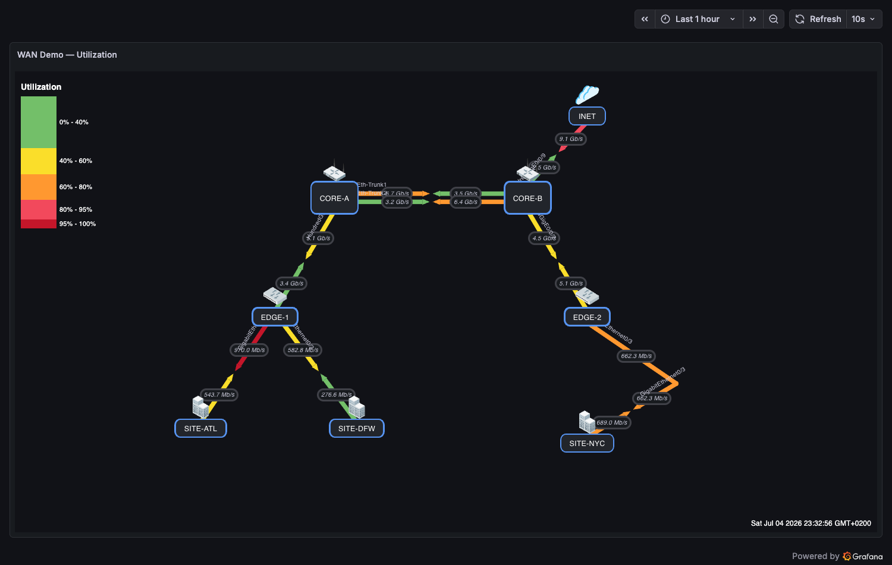

# Data Sources

The weathermap is **datasource-agnostic**: it reads whatever time series Grafana hands it. Any datasource that returns a time field and a numeric value field works — Prometheus, InfluxDB, Elasticsearch, Zabbix, and most others.

!!! tip "The one rule that matters everywhere"
    The panel binds link sides to series by **display name** — the name you see in the link editor's *A/B Side Query* dropdown. Keep your legends/aliases **stable**: renaming a series later breaks the binding, and duplicate display names resolve to the **first** matching series. Always pick series from the dropdown rather than typing names by hand.

## The universal process

Whatever the datasource, building a weathermap dashboard is the same five steps:

1. **Provision the datasource** in Grafana (Connections → Data sources).
2. **Add the panel queries** — typically one series per link side (A = transmit, Z = receive), one per link.
3. **Name each series stably** with the datasource's legend/alias feature (examples per source below).
4. **Bind the series**: in the panel editor open **Links**, select a link, and pick the series in the **A Side Query** and **Z Side Query** dropdowns.
5. **Set bandwidth and thresholds** so the color scale means something.

The demo stack (`cd testing && docker compose up --build`) runs the same simulated WAN metrics through **Prometheus, InfluxDB, and Elasticsearch simultaneously** — a bridge forwards the exporter's values to all three, tagged with identical series names. Three provisioned dashboards render the **same map from the same numbers**:

- *WAN Demo — Utilization* (Prometheus)
- *WAN Demo — Utilization (InfluxDB)* — one Flux query + a rename-by-regex transformation
- *WAN Demo — Utilization (Elasticsearch)* — one terms + date-histogram query, no transformation needed
- *WAN Demo — Utilization (Zabbix)* — one group/host/item wildcard query; item names are the series names, no transformation needed

Open them side by side to see that the weathermap options are byte-identical — only the queries differ. `testing/scripts/generate-datasource-dashboards.py` regenerates the two variants from the Prometheus original.

---

## Prometheus

The canonical setup — all bundled demo dashboards use it.

**Query** (link utilization in bits/s, one direction):

```promql
wm_link_bps{device="core-a", peer="core-b", direction="tx"}
```

**Legend:** set the query's *Legend* field so the display name is stable and readable:

```
{{device}}→{{peer}} {{iface}} {{direction}}
```

If your source exposes counters instead of gauges, wrap with `rate()`:

```promql
rate(ifHCOutOctets{ifName="ge-0/0/1"}[5m]) * 8
```

**Binding:** the legend text is exactly what appears in the A/B Side Query dropdowns.

**Deviations:** none — Prometheus is the baseline; legends map 1:1 to display names.

**Link status (for the `down` state and [traffic animation](animation.md)):** bind a link's **Status Query** to an operational-status series — `0`/absent renders the link *down* (dashed, `DOWN`, and, with animation on, static ✕ badges):

```promql
wm_link_status{link="core-a<->edge-1"}     # demo simulator (1 = up, 0 = down)
ifOperStatus{instance="core-switch", ifName="Gi1/0/1"}   # real SNMP equivalent
```

The *WAN Demo — Animated Traffic Flow* dashboard is driven entirely from these Prometheus series — see the [animation use case](use-cases.md#13-animated-traffic-flow-moving-dots) for the full data path.



---

## InfluxDB

Works with both query languages. The demo stack provisions InfluxDB 2.x (bucket `wm`, org `wm`) on `:8086`, fed by the same simulator.

**Flux:**

```flux
from(bucket: "wm")
  |> range(start: v.timeRangeStart, stop: v.timeRangeStop)
  |> filter(fn: (r) => r._measurement == "wm_link_bps")
  |> filter(fn: (r) => r.device == "core-a" and r.direction == "tx")
  |> aggregateWindow(every: v.windowPeriod, fn: mean, createEmpty: false)
```

Flux names series from the tag set (e.g. `wm_link_bps {device="core-a", direction="tx", ...}`). To control the display name, add:

```flux
  |> map(fn: (r) => ({ r with _field: "core-a→core-b tx" }))
```

**InfluxQL** (v1 compatibility):

```sql
SELECT mean("value") FROM "wm_link_bps"
WHERE ("device" = 'core-a' AND "direction" = 'tx') AND $timeFilter
GROUP BY time($__interval) fill(null)
```

Use **Alias by** to fix the display name: `core-a→core-b tx`.

**Frame shape note:** Influx value fields arrive named `_value` (Flux) or `mean` (InfluxQL) rather than `Value` — the panel resolves the value field by *numeric type*, not by name, so both bind cleanly. This behavior is locked by unit tests.

!!! warning "Deviation: single-label Flux frames display as `value <series>`"
    When a Flux query returns frames with one label, Grafana computes the display name as `value <label value>` — **not** the bare series name. Add a **Rename by regex** transformation (`^value (.*)$` → `$1`) so the display names match your bindings. The demo dashboard ships exactly this transformation.


---

## Elasticsearch

For metrics stored as documents (e.g. from Beats/Logstash or the demo bridge writing to the `wm-metrics` index on `:9200`).

**Query setup:**

- **Query:** Lucene filter, e.g. `device:core-a AND direction:tx`
- **Metric:** `Average` of your value field, e.g. `bps`
- **Group by:** `Date Histogram` on `@timestamp` (interval `auto`)
- Optional second group: `Terms` on `link.keyword` to fan out one query into per-link series

**Alias:** set the query *Alias* to stabilize the display name, e.g. `{{term link.keyword}} tx` or a literal `core-a→core-b tx`.

**Frame shape note:** ES frames often carry names like `Average bps` combined with the term value; whatever ends up as the display name in Grafana's legend is what the link editor's dropdown shows — pick from the dropdown and it binds.

!!! warning "Deviation: cap the panel's Max data points"
    A terms × date-histogram query multiplies buckets: many series at panel-width resolution exceeds Elasticsearch's **65,536-bucket** search limit and the whole query errors. Set the panel's **Max data points** (Query options) so `series × points` stays under the limit — the demo dashboard uses 250 for its 204 series.



---

## Zabbix

The [Zabbix datasource plugin](https://grafana.com/grafana/plugins/alexanderzobnin-zabbix-datasource/) works with the weathermap — and the demo stack runs a **full Zabbix 7.0 server** (UI/API on `:8081`, Admin / zabbix) whose `wm-sim` host receives every simulated series as a trapper item, pushed by the bridge with the zabbix_sender protocol. The pattern:

1. Install and configure the Zabbix plugin datasource (the demo Grafana ships it pre-installed and provisioned).
2. Query per link side using the Group/Host/Item selectors, e.g.:
   - **Group:** `Routers` · **Host:** `core-a` · **Item:** `Interface ge-0/0/1(): Bits sent`
   - Z side: the matching `Bits received` item on the peer, or the same host's receive item — match your monitoring convention.
3. Zabbix's item name becomes the series display name — item names are stable by nature, which suits the binding rule well.
4. Use *Functions → Alias* (`setAlias`) in the Zabbix query editor if you want shorter dropdown names.

!!! warning "Deviation: disable Data alignment"
    The Zabbix datasource's **Data alignment** option (on by default) merges all returned series into a single *wide* frame — and the panel currently binds only a wide frame's first value field, so every other link shows `n/a` (tracked in [#260](https://github.com/allamiro/grafana-network-weathermap-ng/issues/260)). Set **Disable data alignment** in the query options; the demo dashboard ships with it disabled.

!!! warning "Deviation: API payload size on dense history"
    Pulling many items at fine granularity through the Zabbix JSON-RPC API can exhaust the web frontend's PHP `memory_limit` (default 128M → HTTP 500). For dense setups raise it (the demo compose sets `ZBX_MEMORYLIMIT=1024M` on the web container) and enable **trends** in the datasource (the demo uses `trendsFrom: 4h`) so long ranges read hourly aggregates instead of raw history.

!!! note "Counters vs gauges"
    Zabbix network items are usually already rate-calculated (`Bits sent/received` deltas). If yours are raw counters, add the `delta`/`rate` processing on the Zabbix side or via the query editor functions, the same way you'd `rate()` in Prometheus.


---

## Troubleshooting bindings

- **Dropdown shows the series but the link stays `n/a`** — the display name changed after binding (legend edited, label values changed). Re-pick from the dropdown.
- **Two series share a name** — the panel deterministically uses the **first**; give them distinct aliases.
- **No value resolves** — confirm the query returns a numeric field; string-only frames are skipped (the panel logs a console warning).
