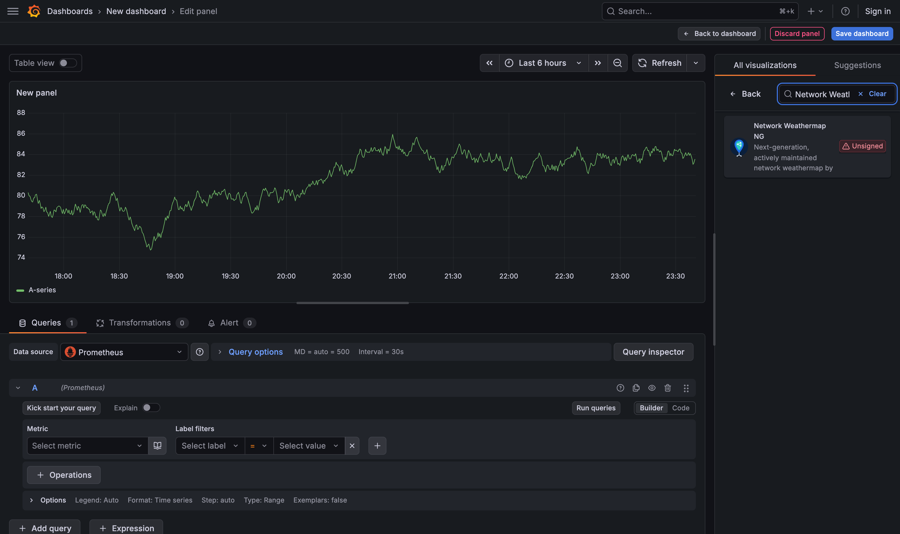
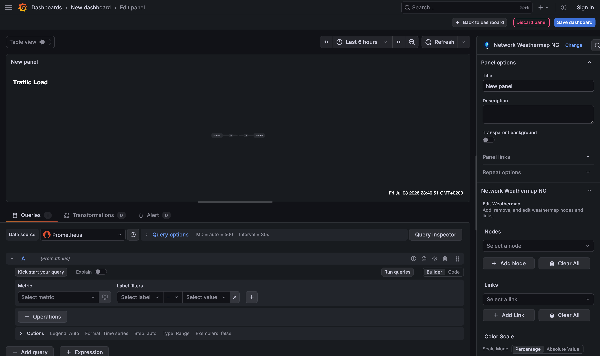
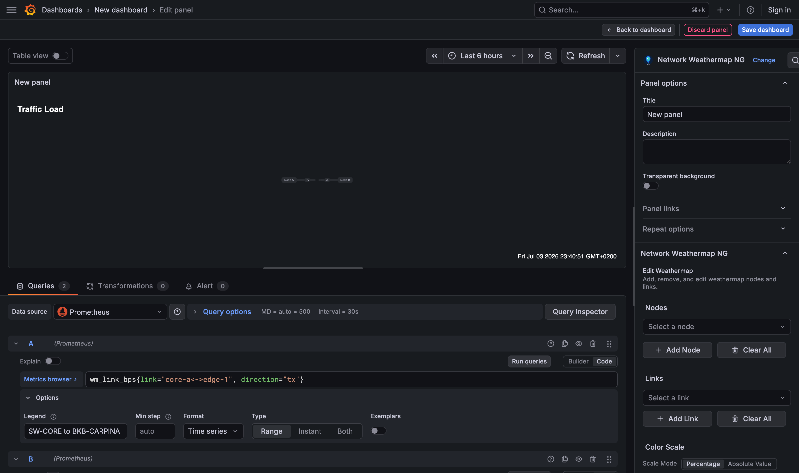
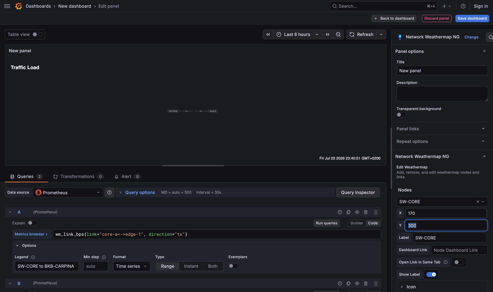
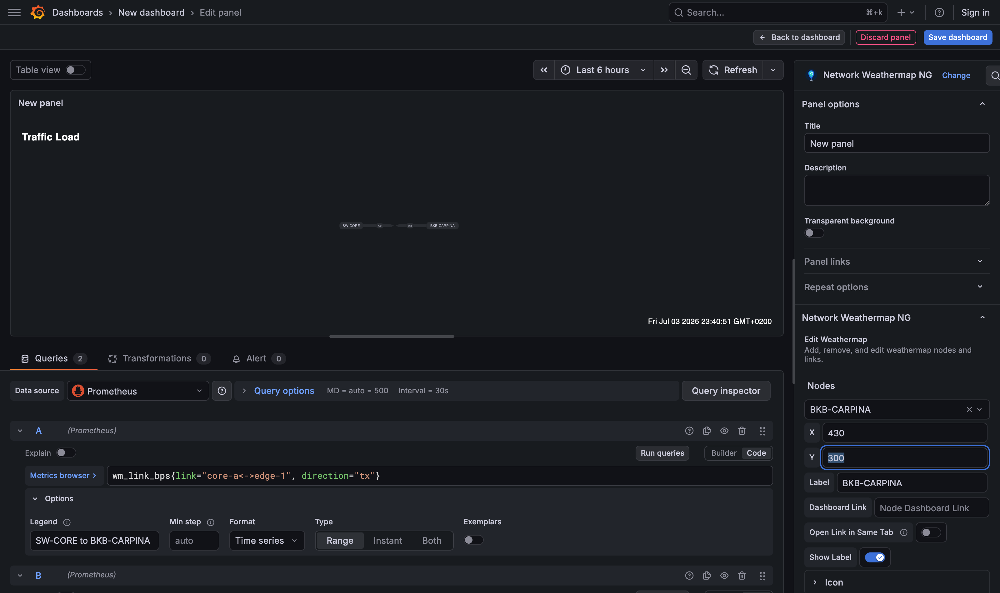
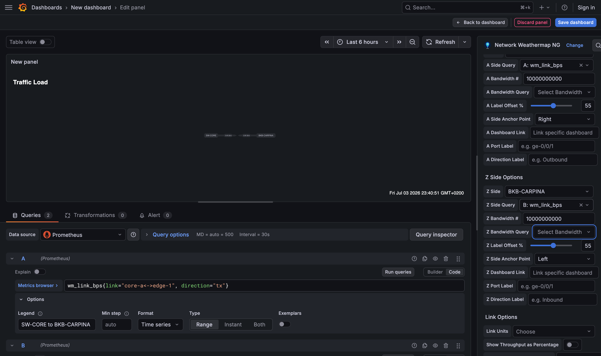
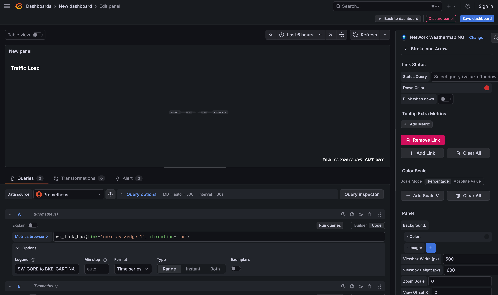
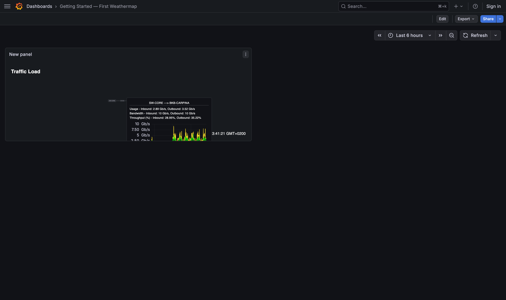

# Getting Started — Your First Weathermap

This guide walks you from an empty dashboard to a live weathermap showing traffic between two devices. It should take about 10 minutes. The screenshots below were taken on Grafana 12.4 with a Prometheus data source — other supported versions look nearly identical.

!!! info "Prerequisites"
    - **Grafana 11.0.0 or later** with the *Network Weathermap NG* panel installed (see [Installation](../index.md#installation)).
    - At least one data source (Prometheus, InfluxDB, Zabbix, or any Grafana-compatible source) returning **time-series interface counters** (e.g. bits/sec in and out of an interface).

---

## 1. Create the panel

1. Open or create a dashboard and click **Add → Visualization**.
2. In the visualization picker, search for **Network Weathermap** and select it.

!!! note ""
    An **Unsigned** badge only appears on local development builds — the plugin installed from the Grafana catalog is signed.

You now have a weathermap canvas with a small starter map (two example nodes, `Node A` and `Node B`, already connected by a link) and, on the right, the panel options under **Network Weathermap NG**.

The map has two states:

| State | How you get there | What you can do |
|---|---|---|
| **Edit mode** | The panel edit screen (where you are now) | Add/move/delete nodes and links, drag VIAs, zoom |
| **View mode** | A saved dashboard | Hover for tooltips, click nodes/links that have dashboard links |

---

## 2. Add your data queries

Weathermap doesn't query data itself — it *reuses the panel's queries*. In the **Queries** tab (below the panel), add the metrics you want to visualize. A typical link needs two series:

- **Outbound (A → Z)** — e.g. interface bits sent
- **Inbound (Z → A)** — e.g. interface bits received

!!! tip "Give queries readable names"
    Weathermap identifies a series by its **display name**. Use a query `refId` or a transform/legend so each series has a clear, unique name — you'll pick it from a dropdown later. In Prometheus, set **Options → Legend → Custom** on each query, as below.

Here query **A** is the outbound series with legend `SW-CORE to BKB-CARPINA`, and query **B** is the inbound series with legend `BKB-CARPINA to SW-CORE`. Click **Run queries** so the panel sees the data.

---

## 3. Add your devices (nodes)

1. In the panel options, open the **Nodes** section.
2. Click **Add Node** (or pick one of the starter nodes from the dropdown). The node's form opens.
3. Set its **Label** (e.g. `SW-CORE`) and, if you like, exact **X**/**Y** coordinates.
4. Or simply drag the node on the canvas to position it. (Hold nothing — just click-drag in edit mode.)
5. Repeat for a second device (e.g. `BKB-CARPINA`).

See [Nodes (Devices)](nodes.md) for icons, status coloring, and per-node tooltips.

---

## 4. Connect them with a link

1. Open the **Links** section and click **Add Link** (or select the starter link from the dropdown).
2. Set **A Side** to your first node and **Z Side** to the second.
3. Under **A Side Options**, set **A Side Query** to your *outbound* series and, optionally, **A Bandwidth #** (or **A Bandwidth Query**) to the link capacity so utilization can be shown as a percentage.
4. Under **Z Side Options**, set **Z Side Query** to your *inbound* series and its bandwidth.

The link now colors itself according to utilization, arrows show direction, and the live values render on the map (`10000000000` = 10 Gbps capacity per side in this example). See [Links](links.md) for units, direction labels, and more.

---

## 5. Set the color scale

1. Open the **Color Scale** section (panel options).
2. Add thresholds mapping a **percentage** (or absolute value) to a color — for example `0% → green`, `50% → yellow`, `80% → orange`, `95% → red`.

Links and the legend now reflect these bands.

---

## 6. Save and use it

1. Click **Save dashboard**, give it a name, and exit the panel editor.
2. In view mode, **hover a link** to see a tooltip with usage, bandwidth, throughput %, and a mini time-series graph.
3. **Hover a node** to see any extra metrics you configured.

---

## Where to go next

- **[Nodes (Devices)](nodes.md)** — icons, status colors, node tooltips, dashboard links
- **[Links](links.md)** — queries, units, direction labels, port labels, parallel links, VIAs
- **[Panel Options](panel-options.md)** — background image, value display modes, timeline slider, tooltips
- **[Interactions & Editing](interactions.md)** — pan/zoom/select on every OS, VIA editing, export
- **[Use Cases](use-cases.md)** — end-to-end scenarios (capacity planning, incident retros, floor plans)
