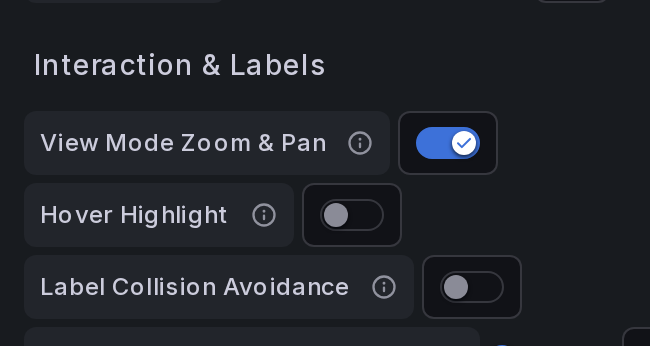
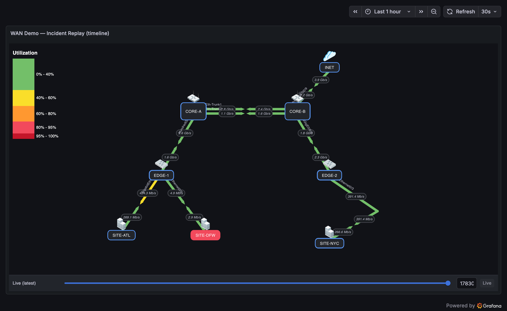

# Interactions & Editing

How to navigate and edit the map with mouse, trackpad, and keyboard — on **Linux, Windows, and macOS**.

---

## Moving things around the map

**Dragging nodes needs no setting — but it only works in the panel editor.** On a saved dashboard the map is deliberately inert, so a viewer can never nudge the topology by accident. There is no "enable dragging" option to look for; opening the editor *is* the switch.

1. Open the dashboard and **hover the panel**.
2. Press **`e`**, or open the panel menu (**⋮**) → **Edit**.
3. Drag nodes (and VIAs, and any other handle) directly on the canvas.
4. Click **Back to dashboard**, then **Save dashboard** — positions are stored in the panel options, so nothing is kept until you save.

If dragging does nothing, you are almost certainly still in view mode — check for the panel-editor toolbar at the top of the screen.

!!! tip "Untangling a crowded map"
    Dragging a node is only one of the tools. When two links overlap, moving a node often just moves the problem; see [Links](links.md) for the two options aimed at it — **Link Offset** for links that share both endpoints, and **waypoints** for routing one link around an obstacle.

---

## Edit mode vs. view mode

- **Edit mode** — the panel edit screen. You can add/move/delete nodes and links, drag VIAs, and zoom freely.
- **View mode** — a saved dashboard. Hover for tooltips; click nodes/links that have dashboard links. Nothing on the map can be moved.

Gestures that change the map are **edit-mode only**, so they cannot interfere with normal dashboard use.

---

## Gesture reference

**Edit mode** below means the gesture works only in the panel editor.

| Action | Linux / Windows | macOS | Mode |
|---|---|---|---|
| **Move a node** | Click-drag the node | Click-drag the node | Edit mode |
| **Multi-select nodes** | **Ctrl**+click each node, then drag any of them | **⌘ Cmd**+click each node, then drag any of them | Edit mode |
| **Add a VIA** | **Double-click** a link | **Double-click** a link | Edit mode |
| **Move a VIA** | Drag the VIA | Drag the VIA | Edit mode |
| **Delete a VIA** | **Right-click** the VIA | **Right-click** (or Ctrl-click) the VIA | Edit mode |
| **Pan the map** | **Ctrl**+drag, **Shift**+drag, or middle-mouse drag | **⌘ Cmd**+drag or **Shift**+drag | Both |
| **Zoom** | Scroll (edit mode); **Shift**+scroll (view mode) | Scroll (edit mode); **Shift**+scroll (view mode) | Both |
| **Zoom & pan in view mode** | Plain scroll / plain drag, when **View Mode Zoom & Pan** is enabled (Panel Options → Interaction & Labels); double-click resets | Same | View mode |

Dragging snaps to the grid when one is enabled (Panel Options → **Grid**), and a drag keeps tracking even if the cursor leaves the panel — release anywhere to commit it.

!!! tip "macOS"
    **View Mode Zoom & Pan** is off by default because plain scrolling over the
    panel would otherwise stop the dashboard page from scrolling. When enabled,
    each viewer's zoom/pan is local to their browser — it is never saved into
    the dashboard — and a double-click returns to the saved view.

    macOS uses **⌘ Cmd** where Linux/Windows use **Ctrl** (Ctrl-click is a right-click on a Mac). Zoom uses the dominant scroll axis, so a Mac's Shift+scroll (which the OS remaps to horizontal) still zooms.

### Enabling View Mode Zoom & Pan

1. **Edit** the panel → in the options, open **Interaction & Labels** and turn on **View Mode Zoom & Pan**.

    

2. **Save** the dashboard.
3. Back in **view mode** (not editing), over the panel: **mouse wheel = zoom**, **left-drag = pan**, **double-click = reset** to the saved view.

Each viewer's zoom/pan is local to their browser and is never written back to the dashboard. With the toggle **off**, viewers still zoom with **Shift**+wheel and pan with **Shift**/**Ctrl**/**⌘**-drag, and plain scrolling passes through to the dashboard page.

---

## Editing VIAs on the canvas

VIAs (waypoints) let a link bend through intermediate points.

1. **Double-click** anywhere on a link to insert a VIA at its midpoint. The link splits into two segments, and the A-side and Z-side query data are preserved on the correct halves.
2. **Drag** the VIA handle to route the link where you want.
3. **Right-click** a VIA to remove it — the two segments merge back into a single link.

Under the hood a VIA is a lightweight *connection node*; you can also toggle a node into a VIA with **Use As Connection** in the node's Advanced options.

---

## Selecting and aligning multiple nodes

- Hold **Ctrl** (Linux/Windows) or **⌘ Cmd** (macOS) and click nodes to build a selection.
- Drag any selected node to move the whole group.
- Enable the **Grid** (Panel Options) to snap positions for clean alignment.

---

## Exporting a map

Open **Panel options → Export**:

- **Export SVG** — download the current map as an SVG image (icons are inlined). Useful for documentation and diagrams.
- **Export JSON** — download the full weathermap configuration as JSON. You can version-control it or import it into another panel.

---

## Timeline scrubbing

If the [Timeline Slider](panel-options.md#timeline-slider) is enabled, drag the slider at the bottom of the panel to move through history; press **Live** to return to the latest state.

The *WAN Demo — Incident Replay* dashboard from the [testing stack](https://github.com/allamiro/grafana-network-weathermap-ng/tree/main/testing#readme) shows the difference. **Live** — the slider label reads *Live (latest)* and the map shows current values; everything here is healthy:

**Scrubbed** — the label shows the selected historical timestamp, and the map replays that moment: `SITE-DFW`'s link has collapsed to a few Mb/s during its outage window. Press **Live** to snap back:

Only link values replay while scrubbing; node status coloring follows the latest value.
