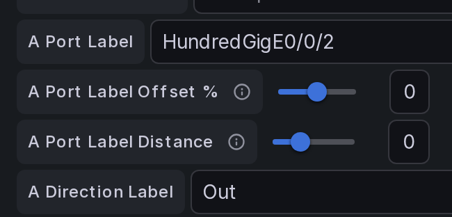
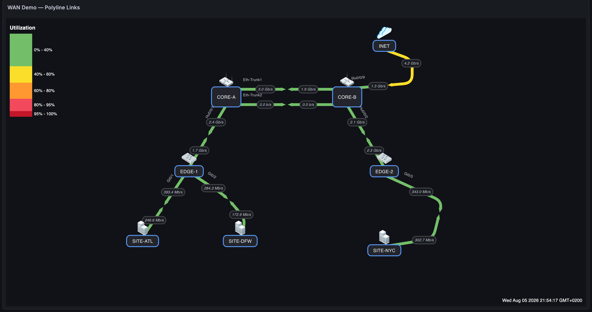
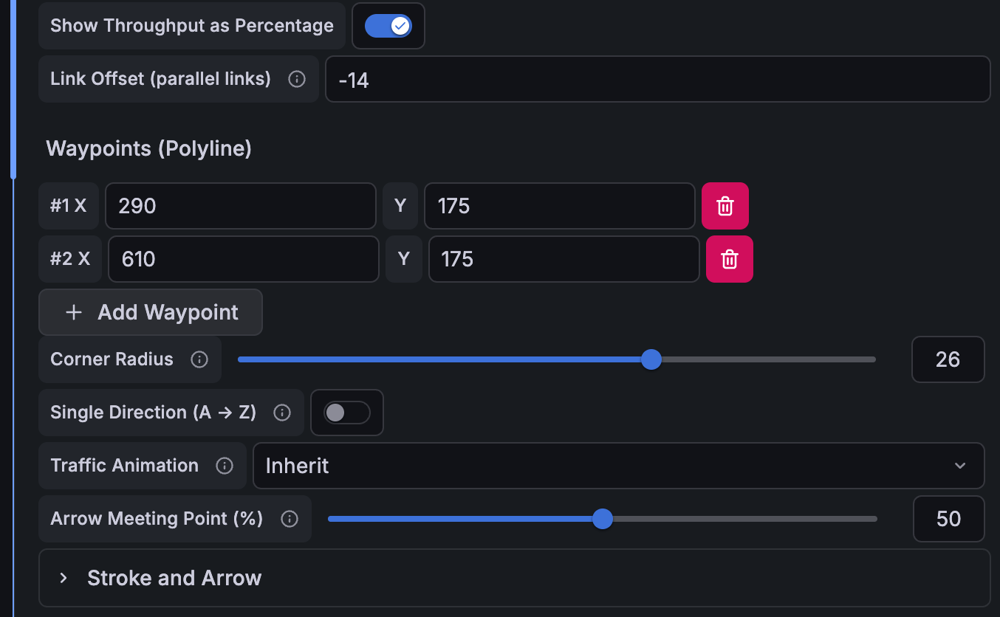
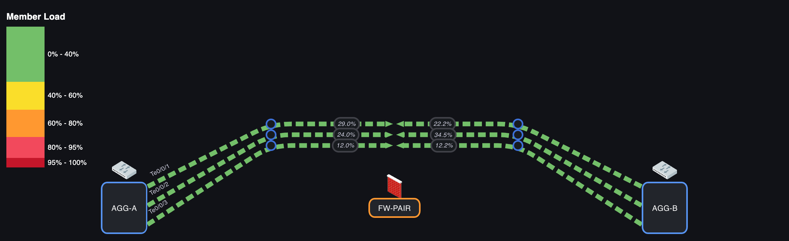
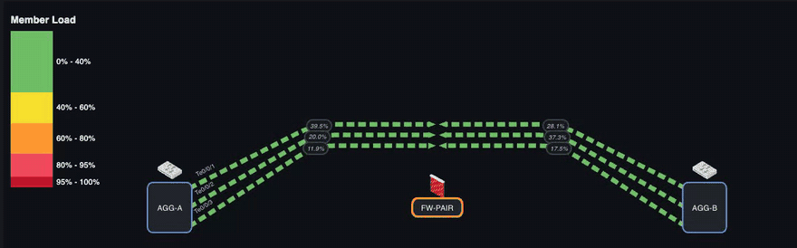

# Links

A **link** connects two nodes and visualizes the traffic between them. Each link has two **sides** — **A** and **Z** — so it can show bidirectional flow (A → Z outbound, Z → A inbound).

Open **Panel options → Links**, select a link from the dropdown, or click **Add Link**.

---

## A / Z sides and endpoints

- **A Side** / **Z Side** — the two nodes the link connects.
- Each side has its own query, bandwidth, anchor, and labels, so inbound and outbound can be independent.

**Anchor Point** controls where the link attaches to a node (Center, Top, Bottom, Left, Right) — useful for routing links cleanly around a busy map.

*The full per-side form: side node, side query, fixed bandwidth (10 Gbps here), label offset, anchor point, dashboard link, port label, and direction label.*

---

## Queries and bandwidth

For each side:

| Field | Purpose |
|---|---|
| **Side Query** | The series whose value drives this side's color/label (e.g. bits sent). |
| **Bandwidth #** | A fixed capacity (e.g. `20000000000` for 20 Gbps) so utilization can show as a percentage. |
| **Bandwidth Query** | Use a series for capacity instead of a fixed number (e.g. interface speed). |

With bandwidth set, the tooltip and coloring can express **throughput %** (current ÷ bandwidth), which is how the color scale bands are matched by default.

---

## Units and decimals

- **Link Units** — a per-link unit formatter (bps, Bps, packets/s, …). Falls back to the panel's **Default Link Units**.
- **Link Value Decimal Places** (panel option) — fixes the number of decimals on all link labels; leave blank for automatic precision.

---

## Labels and label offset

- **Label Offset** — slide the value text along the link (0–100%). Handy when two labels overlap.
- **Port Label** — a per-side interface name (e.g. `ge-0/0/1`) rendered next to the link at 25% from each endpoint, rotated to follow the line.
- **Port Label Offset %** — slide a port label **along the link axis** (−50…50). `0` (default) keeps the position above; positive moves it toward the midpoint, negative toward the node.
- **Port Label Distance** — move a port label **perpendicular to the link line** (−30…60 px). `0` (default) keeps the current distance; positive pushes it further from the line, negative brings it closer or across. Between the two you can lift a label clear of a node icon, an arrow, or a parallel link.

**Positioning a port label:**

1. **Edit** the panel → open **Links** and select a link from the dropdown.
2. Under **A Side Options** / **Z Side Options**, set the **Port Label**, then use the two sliders: **Port Label Offset %** (along the link) and **Port Label Distance** (away from the link).

    

3. **Save** the dashboard — the label sits where you placed it.

!!! tip "Label overlapping a node?"
    Port labels sit ~25% from each endpoint, so on dense maps they can overlap the node icon or its label. Nudge **Offset %** positive (toward the midpoint, away from the node) and/or **Distance** to lift it off the icon.

*Port labels (interface names near each endpoint) and value labels on a live WAN map — from the [demo dashboards](use-cases.md).*

---

## Direction labels (inbound / outbound)

By default the tooltip labels values as generic *Inbound / Outbound*. Set an explicit **Direction Label** per side (e.g. `TX-UPLINK`, `RX-DOWNLINK`, `To WAN`) and the tooltip uses your wording instead — removing the implicit A/Z ambiguity. Because each value is labeled by its own side, the naming stays correct no matter which side you hover.

Leave the fields blank to keep the classic Inbound/Outbound behavior.

---

## Arrow meeting point

The two directional arrows meet at the midpoint of a link by default. Use the **Arrow Meeting Point (%)** slider (Link Options) to shift where they meet — lower values move the junction toward the **A** side, higher toward **Z**. Great for asymmetric links and for maps that use VIAs.

---

## Waypoints (polyline links)

By default a link is a straight line. Add **waypoints** (Link Options → **Waypoints (Polyline)**) to draw it as a **polyline** — one logical link bent through any number of intermediate points, without splitting it into segments the way [VIAs](#vias-waypoints) do. Ideal for routing many links around each other or tracing a real geographic path on a map background.

*The WAN demo with three polyline links: the DFW site link bowed out to the left, the NYC link arced through two bends tracing a geographic-style path, and the INET uplink routed around the top-right corner — each still one logical link with its own queries, labels, and arrows. Try it locally with the `WAN Demo — Polyline Links` dashboard in the [testing environment](https://github.com/allamiro/grafana-network-weathermap-ng/tree/main/testing).*

- **Create on the canvas** (edit mode): **right-click anywhere on a link** to insert a waypoint at that exact spot. (Double-click still inserts a [VIA](#vias-waypoints) — the two gestures coexist.) Or use **Add Waypoint** in the link form, which seeds one halfway toward the Z node; each waypoint is an X/Y coordinate in panel space, ordered A → Z, editable numerically for precision.
- **Edit directly on the canvas** (edit mode): every waypoint shows a circular **drag handle** — drag it to reshape the link live (grid snapping applies; the drag keeps tracking even if your cursor leaves the panel), release to save. **Right-click** a handle to remove that waypoint. Keyboard: focus a handle with Tab, nudge with **arrow keys** (Shift = 10 px), remove with **Delete**.
- **Corner Radius** (shown once waypoints exist) rounds each bend with a smooth curve — `0` keeps sharp corners; the radius clamps automatically so neighboring bends never overlap.
- **Space your bends at least twice the Corner Radius apart.** Each bend's radius is capped at half the length of the shorter adjoining segment, so two waypoints 30 px apart can only round to 15 px however high the slider goes. If a corner looks squarer than you asked for, the neighbouring bend is too close — move it out rather than raising the radius.
- Everything follows the drawn path by **arc length**: both directional halves, the arrowheads (which rotate with the segment they sit on), the value labels, the [arrow meeting point](#arrow-meeting-point) percentage, port labels, and [traffic animation](animation.md) dots — which travel around the bends.
- **Link Offset (parallel links)** combines with waypoints: the whole polyline shifts sideways, keeping its shape. See [Parallel links](#parallel-links-link-offset).
- An empty waypoint list is exactly the old straight link, so existing maps are unchanged.

One current limitation: **gradient link coloring** still shades along the straight A→Z axis, which can look odd on sharp bends.

### Step by step: bend a link

Everything below happens in **edit mode** (open the panel editor). Click any screenshot to enlarge it.

**1. Open the link.** In the panel options, under **Network Weathermap NG → Links**, pick the link from **Select a link**. Scroll down to **Link Options**.

**2. Add the bend points.** Press **Add Waypoint** once per bend. Each one appears as an `#n X` / `Y` coordinate pair in panel space, ordered A → Z. Type exact numbers here, or place them roughly and drag them on the canvas in step 4.

*The link form for one LAG member: **Link Offset** `-14`, two waypoints at `(290, 175)` and `(610, 175)`, and **Corner Radius** `26`. The two settings combine — this member follows the shared bent route, shifted 14 px off it.*

**3. Round the corners (optional).** The **Corner Radius** slider appears as soon as the link has a waypoint. `0` keeps sharp corners; higher values curve each bend. The radius is clamped to half of each adjacent segment automatically, so neighbouring bends can never overlap however high you push it — which also means **bends closer together than twice the radius round less than you asked for**. For a `26` px radius like the demo below, keep consecutive waypoints (and the first/last waypoint from its node) at least ~52 px apart; if a corner comes out squarer than expected, widen the spacing instead of raising the slider.

**4. Shape it on the canvas.** Each waypoint draws a circular **drag handle**. Drag one to reshape the link live — the whole path follows as you move, and the change is saved once when you release (so it is a single undo step). **Right-click** a handle to delete that waypoint, or focus it with Tab and use the arrow keys (Shift = 10 px) and Delete.

*Edit mode on the demo bundle: three drag handles at each bend, one per member. The handles sit on the line as drawn — including the Link Offset shift — while the coordinates they write back stay unshifted, so changing the offset never moves your waypoints.*

**5. Spread parallel links (optional).** To run more than one link along the same route, give each a different **Link Offset**. See [Parallel links](#parallel-links-link-offset) below.

!!! tip "Adding a waypoint without the form"
    **Right-click anywhere on a link** in edit mode inserts a waypoint at that exact spot, in the right position along the path. It is the fastest way to add a bend where you want it — then drag the handle to fine-tune.

---

## Parallel links (link offset)

To draw **multiple links between the same two nodes** without overlap, set a different **Link Offset (parallel links)** on each. The offset shifts the line perpendicular to its A→Z axis; arrows, labels, and coloring all follow the offset line. Zero (default) keeps the straight line.

This works on [polyline links](#waypoints-polyline-links) too: the **entire path** — bends included — shifts along that one axis, so the link keeps its exact shape and its arc length. That matters in practice, because it means every member of a parallel bundle keeps its arrows, value labels, and animation in step with the others, and a bend can never fold in on itself no matter how large the offset or how tight the corner. Waypoint coordinates are stored unshifted, so changing the offset never rewrites them — the drag handles move with the drawn line and keep editing the underlying points.

*A three-member LAG drawn with per-link offsets — each member keeps its own query, port label, and utilization %.*

### A bundle on a bent route

The same LAG, routed around an obstruction through two shared waypoints. Each member keeps its own offset, so the three stay evenly spaced through both corners instead of converging:

*`Link Offset` `-14` / `0` / `+14` on three links that share the same two waypoints and a `26` px corner radius. [Traffic animation](animation.md) follows each bent path, and because shifting a polyline preserves its length, all three members animate in step — the dashes stay aligned across the bundle the whole way round.*

To build it: give each link the **same** waypoints and corner radius, then a **different** Link Offset. Because waypoints are stored unshifted, you can copy the same coordinates to every member and let the offsets do the spreading.

The demo above ships as the `WAN Demo — Polyline Links + Link Offset` dashboard in the [testing environment](https://github.com/allamiro/grafana-network-weathermap-ng/tree/main/testing).

---

## Link status (up / down)

Give a link a **Status Query** so it can render as *down*:

- When the status value is `0` or absent, the link uses a configurable **down color** and a **dashed** stroke.
- Optional **blink** animation draws attention to down links.
- While down, status rendering overrides gradient/flow-animation.
- When [traffic animation](animation.md#down-links) is enabled for the link, a down status also replaces the moving dots with static **✕ badges** and labels both sides **DOWN**.

---

## Traffic animation (per-link override)

When [traffic animation](animation.md) is available, each link has a **Traffic Animation** control:

| Value | Behavior |
|---|---|
| **Inherit** (default) | Follows the panel-level **Enable Traffic Animation** switch. |
| **Enabled** | Animates this link even when the panel switch is off. |
| **Disabled** | Never animates this link, even when the panel switch is on. |

Animation uses this link's existing A/Z values and bandwidths — no extra queries. Dots move A→Z for the A-side value and Z→A for the Z-side value; speed and density scale with utilization. See [Traffic Animation](animation.md) for the full behavior.

---

## Tooltip extra metrics

Add extra rows to the link's hover tooltip (errors, discards, drops, latency, …). In the link's **Tooltip Extra Metrics** section, **Add Metric** with a **Label**, an optional **Inbound Query** and **Outbound Query**, and a **Units** formatter. These rows use your [direction labels](#direction-labels-inbound-outbound) when set.

---

## Stroke and arrows

Under **Stroke and Arrow**:

- **Link Stroke Width** — line thickness.
- **Arrow Width / Height / Offset** — arrow geometry.
- (Panel-level) **Dynamic Stroke** can scale stroke width with utilization, and **Flow Animation** can animate dashes in the direction of flow.

---

## VIAs (waypoints)

A **VIA** is an intermediate bend point on a link — useful to route a link around obstacles or to represent a multi-hop path. VIAs use lightweight *connection nodes* under the hood: the link **splits into real segments** at each VIA, which is what you want when the bend represents an actual intermediate hop. If you only want to bend the drawn line, prefer [waypoints](#waypoints-polyline-links) — they keep the link as one logical unit.

*One DC interconnect routed through three VIAs — exactly what double-click VIA editing produces.*

**Edit a VIA directly on the canvas (edit mode):**

- **Add** — **double-click** a link. A VIA is inserted at the link midpoint (the link splits into A→C and C→Z, preserving each side's query data).
- **Move** — **drag** the VIA like any node.
- **Delete** — **right-click** the VIA; the two segments merge back into one link.

See [Interactions & Editing](interactions.md) for the full gesture reference.
