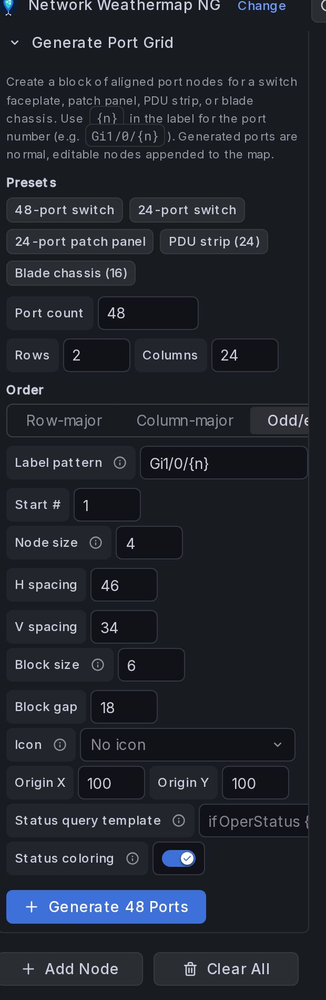
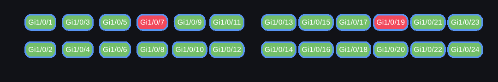

# Nodes (Devices)

A **node** represents a device on your map — a switch, router, firewall, server, site, or any logical entity. This page covers every node option.

Open **Panel options → Nodes** to manage nodes. Select a node from the dropdown to edit it, or click **Add Node**.

---

## Add, position, duplicate, and remove

- **Add Node** — creates a node in the centre of the canvas.
- **Move** — in edit mode, click and drag the node on the canvas.
- **Duplicate** — copies a node (including its colors and icon) next to the original.
- **Remove** — deletes the node and any links attached to it.

!!! tip "Snap to a grid"
    Enable **Panel Options → Grid** to make dragging snap to a fixed grid for tidy alignment.

---

## Generate a port grid

Building a switch faceplate, patch panel, PDU strip, or blade chassis by hand means placing dozens of small nodes one at a time. **Generate Port Grid** (in the **Nodes** section, next to **Add Node**) creates a whole block of aligned port nodes in one action.

Start from a **preset** (one click fills the form for a common device — *48-port switch*, *24-port switch*, *24-port patch panel*, *PDU strip*, *blade chassis*), then adjust any field. Presets are just starting parameters — the generator itself is device-agnostic.

Open the **Generate Port Grid** panel and set:

| Field | Purpose |
|---|---|
| **Port count** | How many port nodes to create. |
| **Rows / Columns** | The grid the ports fill. |
| **Order** | **Row-major** (left→right, then down — patch panels), **Column-major** (top→bottom, then across), or **Odd/even (faceplate)** — odd ports on the top row, even directly below, exactly like a real 48-port switch. |
| **Label pattern** | The port label. `{n}` is replaced with the port number, e.g. `Gi1/0/{n}` → `Gi1/0/1`, `Gi1/0/2`, … |
| **Start #** | The first port number (default 1). |
| **Node size** | Padding applied to every generated node. |
| **H / V spacing** | Gap between columns / rows, in pixels. |
| **Block size / gap** | Insert an extra gap after every N columns, so a 48-port board breaks into faceplate blocks (like real switch hardware) instead of one even strip. `0` = no blocks. |
| **Icon** | *Optional.* Draw a built-in icon on every generated port. |
| **Origin X / Y** | Top-left corner of the block. |
| **Status query template** | *Optional.* Bind a status query to every port at once — `{n}` → port number, `{label}` → the generated label (e.g. `ifOperStatus {label}`). |
| **Status coloring** | Fills each port **green when up** (value ≥ 1) and **red when down** (0) — the standard switch-LED convention — so the block reads as a live port board. On by default; pair it with the status query template. |

Then click **Generate … Ports**. The ports are appended as **normal, editable nodes** — you can move, recolor, icon, and query them like any other node, and they save/reload with the dashboard. When **Panel Options → Grid** snapping is on, generated positions snap to it so ports line up with hand-placed nodes.

A generated 24-port switch board, colored live from a port-status query — odd/even faceplate ordering, block gaps, green up / red down:

!!! tip "Place it over a faceplate background"
    Generate the grid, then drop a switch/patch-panel image via **Panel Options → Background Image** and nudge **Origin X/Y** so the ports sit on the physical jacks.

---

## Label

The **Label** is the text shown on/under the node. Leave it blank (and use an icon) for an icon-only node. You can also hide the label with **Show Label** while keeping the node interactive.

---

## Icons

Under a node's options you can choose an **icon**:

- **Preset icons** — Cisco, generic networking, database, and computer icon sets are bundled.
- **Custom Icon** — choose *Custom Icon* and paste an image URL.

!!! warning "Custom icon URLs are validated"
    Only safe relative Grafana paths (e.g. `public/img/...`) and `http`/`https` URLs are allowed. `javascript:`, `data:`, `file:`, and similar schemes are rejected for security.

Icon options:

| Option | Purpose |
|---|---|
| **Size (W×H)** | Icon dimensions. Toggle **lock aspect ratio** to scale proportionally. |
| **Padding** | Space between the icon and the label/box. |
| **Draw Inside** | Draw the icon inside the node rectangle instead of above the label. |
| **Use Icon Boundary For Links** | Attach links to the icon edge rather than the text box. |

---

## Dashboard link

Give a node a **Dashboard Link** to make it clickable in view mode — clicking navigates to that URL (e.g. a device detail dashboard `/d/abc/switch-detail`).

- **Open Link in Same Tab** — navigate in the current tab (`_self`) instead of a new one.

!!! warning "URLs are validated and opened safely"
    Node dashboard links are sanitized (relative Grafana paths and `http`/`https` only) and opened with `noopener,noreferrer`.

---

## Status coloring (node health)

Color a node based on a metric to show device health.

Open the node's **Status** section:

1. **Query** — pick the series whose value drives the color (e.g. `up`, CPU %, temperature).
2. **StatusDown Color** — the color used when the value indicates "down".
3. **Color Target** — apply the status color to the **Border**, **Background**, or **Both**.
4. **Threshold Mappings** — add `value ≥ threshold → color` rules. The **highest matching threshold wins**. This overrides the default "value < 1 = down" rule and lets you color by CPU utilization, temperature, availability score, etc.

**Example — CPU heat:** `0 → green`, `60 → yellow`, `85 → red`, Color Target = *Background*.

---

## Node tooltips (extra metrics)

Show additional values when hovering a node (latency, packet loss, CPU, or any bound query).

Open the node's **Tooltip** section and **Add Metric**. For each metric set:

- **Label** — e.g. `Latency`, `Packet Loss`, `CPU`
- **Query** — the series to read
- **Units** — a unit formatter (e.g. seconds, percent, bytes)

On hover, the node shows its label plus each metric and value. Values follow the panel's [Value Display Mode](panel-options.md#value-display-mode) and the [timeline slider](panel-options.md#timeline-slider).

---

## Advanced

| Option | Purpose |
|---|---|
| **Constant Spacing** | Keep uniform spacing between multiple links on a side. |
| **Compact Vertical Links** | Tighten vertically stacked links. |
| **Use As Connection (BETA)** | Turn the node into a **VIA / waypoint** (a bend point on a link rather than a device). See [Links → VIAs](links.md#vias-waypoints). |

---

## Colors

Each node has **Font**, **Background**, **Border**, and **StatusDown** colors. Use **Apply to All** to copy one node's colors to every node for a consistent theme.
