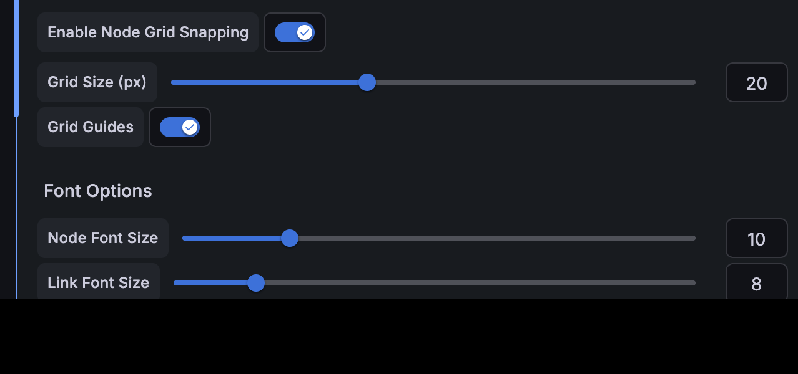
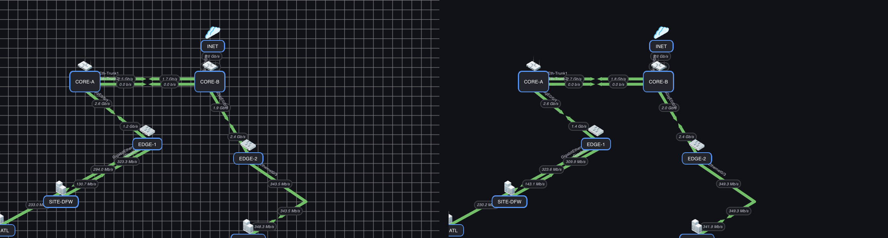

# Panel Options

Panel-level options apply to the whole weathermap. Open the panel options sidebar and look under **Panel** and **Link Options**.

---

## Background

!!! tip "Where do I host my floor plan / map image?"
    The **Image** field takes a URL — the plugin does not upload files. Your options:

    1. **Any `http://` or `https://` URL** your dashboard viewers' browsers can reach (an internal web server, a wiki attachment, an S3/object-storage link, Wikimedia Commons, ...). Prefer `https` where you have it — but plain `http` is accepted, which matters for lab and air-gapped intranets.
    2. **Grafana's own `public/` folder** — copy the file onto the Grafana server, e.g. `/usr/share/grafana/public/img/floorplan.png`, then use the relative URL `public/img/floorplan.png`. Works fully air-gapped and survives viewer networks that can't reach external hosts.
    3. **A provisioned sidecar** — the demo dashboards serve their floor-plan and world-map images from the `testing/` stack's exporter container on `:8080`; any tiny static file server works the same way.

    SVG or PNG both work; prefer SVG for crisp zooming with **Move With Map**.

!!! warning "Image URLs are validated"
    Only relative Grafana paths and `http`/`https` URLs are accepted. `data:`, `file:`, `javascript:` and other schemes are **rejected** by the plugin's URL sanitization — pasting a base64 data URL will not work.

- **Color** — the canvas background color.
- **Image** — set a background image by URL (floor plan, geographic map, building outline, network zones). Choose an **Image Fit** (contain / cover / auto).
- **Move With Map** — when enabled, the background image is drawn *inside* the map canvas so it **pans and zooms together** with the nodes and links. When off (default), the image stays fixed like a wallpaper.

---

## Canvas size, zoom, and offset

| Option | Purpose |
|---|---|
| **Viewbox Width / Height (px)** | The logical size of the drawing area. |
| **Zoom Scale** | Current zoom level (also controlled by scroll — see [Interactions](interactions.md)). |
| **View Offset X / Y** | Current pan offset. |
| **Display Timestamp** | Show the time-range end timestamp in the corner. |

---

## Grid (snapping and guide lines)

The grid makes node dragging snap to fixed steps, so a large map can be aligned cleanly instead of by eye. It is **off by default** — a new panel has no grid and no guide lines.

### Where the options are

**Edit** the panel → in the options sidebar, scroll to **Grid Options**:

| Option | What it does |
|---|---|
| **Enable Node Grid Snapping** | The master switch. Node drags snap to the grid. Turning this **off also clears Grid Guides** for you. |
| **Grid Size (px)** | The step that drags snap to. Only shown while snapping is on. |
| **Grid Guides** | Draws the grid lines so you can see what you are snapping to. |

### Turning the grid lines on

1. **Edit** the panel (hover it and press `e`).
2. Open **Grid Options** and turn on **Enable Node Grid Snapping**.
3. Set a **Grid Size** — 10–25 px suits most maps.
4. Turn on **Grid Guides** to see the lines.
5. **Back to dashboard → Save dashboard.**

### Turning the grid lines off

| Goal | Do this |
|---|---|
| Remove the lines, **keep** snapping | Turn off **Grid Guides** |
| Remove **both**, in one toggle | Turn off **Enable Node Grid Snapping** — it clears the guides for you |

*The same map while editing: **Grid Guides on** (left) and **off** (right). Snapping is on in both — the lines only change whether you can see the grid you are snapping to.*

!!! note "Guide lines are an editing aid only"
    Grid Guides are drawn **only while the panel editor is open**. A saved dashboard never shows them, because a viewer cannot drag anything and the lines would just be graph paper over the map. Snapping is unaffected, and the setting itself is preserved — reopen the editor and the guides come back.

---

## Value Display Mode

Controls how each metric is resolved from the data points **across the selected dashboard time range**:

| Mode | Meaning |
|---|---|
| **Last** | The most recent data point (default). |
| **Average** | Mean of all points in the range. |
| **Min** | Smallest value in the range. |
| **Max** | Largest value in the range. |
| **95th Percentile** | 95th percentile over the range. |

Use **Average / 95th Percentile** for capacity-planning views where a single-point snapshot is misleading; **Max** to catch peaks.

---

## Timeline Slider

Enable **Timeline Slider** to add a scrubber at the bottom of the panel. Drag it to move through the selected time range and see **link values as they were at that moment** — the map's link values update retroactively.

- A **timestamp label** shows the selected time.
- The **Live** button returns to the latest/aggregate value.
- Off by default; enabling it changes nothing until you scrub.

Perfect for **incident retrospectives** (replay an outage), **trend analysis**, and comparing **peak vs. baseline** periods.

!!! note "Scope"
    The slider currently scrubs **link values**. Node status coloring follows the latest value.

---

## Animation (traffic flow)

The **Animation** section turns on metric-driven **moving dots** along links, showing traffic direction and intensity. It is **off by default** and changes nothing until enabled.

| Option | Default | What it does |
|---|---|---|
| **Enable Traffic Animation** | Off | Master switch for all link animation. |
| **Respect Reduced Motion** | On | AND-gated with the viewer's OS *prefers-reduced-motion* preference. |
| **Pause In Edit Mode** | On | Freezes animation while editing the panel. |
| **Show Animation Legend** | On | Built-in legend; only shown while animation is active. |
| **Max Animated Links** | 100 | Hard cap on simultaneously animated links (large-map safety). |

Individual links can also opt in or out via the link editor. See the full guide — data sources, PromQL, speed/density mapping, down-link behavior — in [Traffic Animation](animation.md).

---

## Default link units and decimals

- **Default Link Units** — the unit formatter used by links that don't set their own.
- **Link Value Decimal Places** — fixes decimal precision on link labels (blank = automatic).

---

## Coloring behavior

| Option | Purpose |
|---|---|
| **Color Scale Mode** | Match thresholds by **percent** (current ÷ bandwidth) or by absolute **value**. |
| **Gradient Color** | Blend the link color between its A and Z endpoint colors. |
| **Dynamic Stroke** | Scale link stroke width with utilization (min/max width). |
| **Flow Animation** | Animate the link's dashes in the direction of flow (with a speed setting). |

---

## Color scale / thresholds

Define the **Color Scale** — a list of `threshold → color` stops. Depending on **Color Scale Mode**, thresholds are matched against utilization **percent** or the raw **value**. The legend at the bottom of the panel reflects these bands. Thresholds above 100% are supported for oversubscribed links.

---

## Tooltip settings

Customize the hover tooltip: **font size**, **text/background colors**, **inbound/outbound line colors**, and whether the mini graph scales to bandwidth.
