# Use Cases & Scenarios

End-to-end recipes that combine the options into real dashboards. Each assumes you've completed [Getting Started](getting-started.md).

!!! tip "Try every scenario live"
    Each recipe below has a ready-made **demo dashboard** with simulated enterprise traffic. From a checkout of the repo:

    ```bash
    npm install && npm run build
    cd testing && docker compose up --build
    ```

    then open `http://localhost:3101` → **Dashboards**. The data generator keeps producing realistic traffic (diurnal cycles, bursts, a periodically saturating link, a flapping device) for as long as the stack runs. The screenshots on this page are captured from those dashboards.

---

## 1. WAN link utilization (two sites)

**Goal:** show a core uplink between two sites, colored by utilization, with clear inbound/outbound labels.

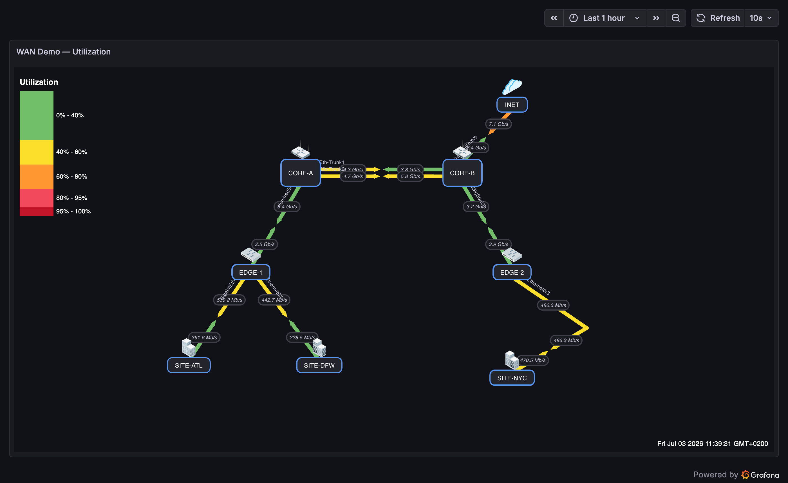

1. Add nodes `SW-CORE` and `BKB-CARPINA`.
2. Add a link A=`SW-CORE`, Z=`BKB-CARPINA`.
   - **A Side Query** = the outbound direction A→Z — `SW-CORE`'s interface *bits sent*; **A Bandwidth #** = link capacity (e.g. `20000000000`).
   - **Z Side Query** = the reverse direction Z→A. Use either `BKB-CARPINA`'s *bits sent* **or** `SW-CORE`'s *bits received* (both represent Z→A) — not `BKB-CARPINA`'s *bits received*, which is the same A→Z direction as the A side; **Z Bandwidth #** = same capacity.
3. Set **A Direction Label** = `Outbound`, **Z Direction Label** = `Inbound`.
4. Add **Port Labels** (e.g. `Eth-Trunk12`) so the physical interface is visible.
5. Give each node an **Icon** — the plugin bundles 680+ icons across Cisco, networking, database, computer, **country flag** (ISO 3166, circle style), and **rack part** (faceplates, PSU, fans, PDU, ports) sets, plus custom icon URLs.
6. Color scale: `0→green, 50→yellow, 80→orange, 95→red` with **Color Scale Mode = percent**.

Hovering the link shows usage, bandwidth, throughput %, and a mini graph.

**Demo:** *WAN Demo — Utilization* — 8 devices, parallel core links, a VIA-curved long-haul, and click-through from the SITE nodes to the floor-plan dashboard.

---

## 2. Capacity planning (avg / 95th percentile)

**Goal:** compare typical vs. peak load over a period, not just the instantaneous value.


1. Build the map as in scenario 1.
2. Set the dashboard time range to the period of interest (e.g. *last 30 days*).
3. **Panel Options → Value Display Mode:**
   - Choose **95th Percentile** to size links for sustained peaks, or **Average** for typical load.
   - Switch to **Max** to spot the worst-case moment.
4. Compare against your color-scale bands to find links that are hot at p95.

**Demo:** *WAN Demo — Capacity Planning (p95)* — the `EDGE-1 ↔ SITE-ATL` link saturates for ~90 s every 7 minutes; at p95 that stays visible long after each burst passes.

---

## 3. Incident retrospective (timeline replay)

**Goal:** replay how the network looked during an outage window.

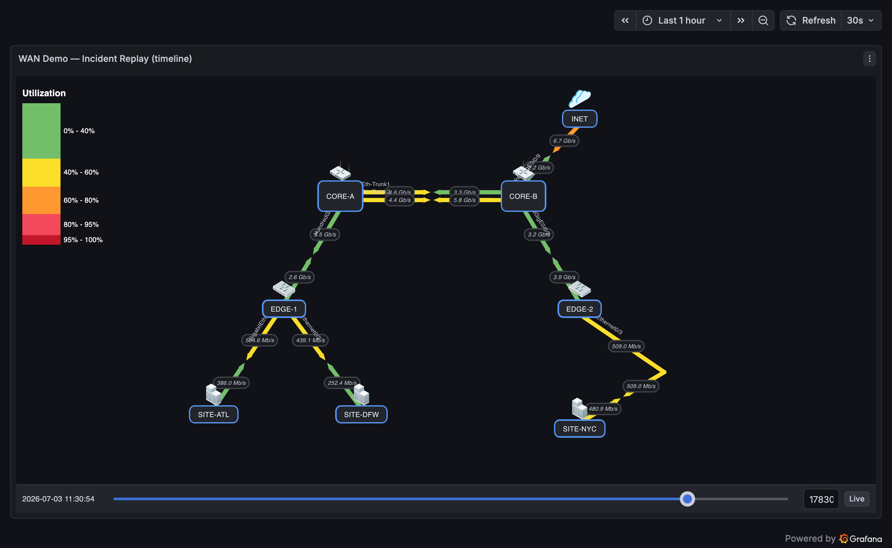

1. Enable **Panel Options → Timeline Slider**.
2. Set the dashboard time range to span the incident.
3. In view mode, **drag the slider** to the moment the incident began and step forward — link colors and values update to that time.
4. Use the timestamp label to correlate with alerts/logs. Press **Live** to return to now.

**Demo:** *WAN Demo — Incident Replay (timeline)* — `SITE-DFW` goes down for ~2 minutes every 10; scrub back to watch its link collapse and recover.

---

## 4. Data-center floor plan (background follows the map)

**Goal:** overlay devices on a floor plan or rack layout that zooms/pans with the map.

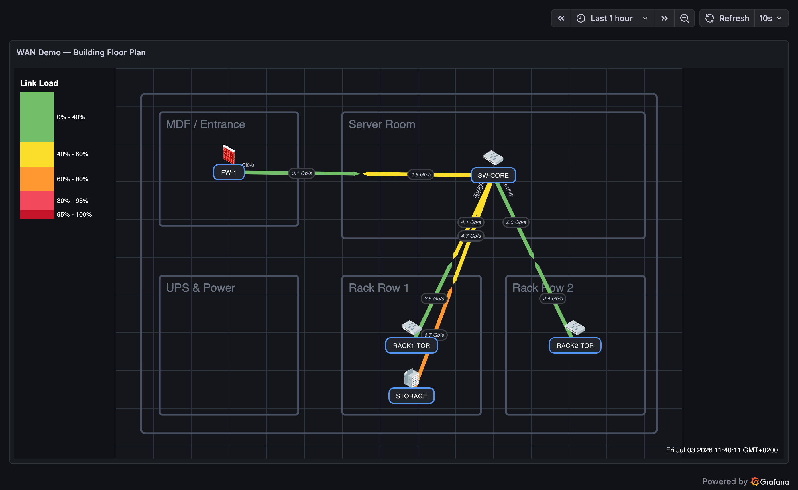

!!! tip "Background image hosting"
    The background is a **URL** — any `http://` or `https://` link works, or drop the file in Grafana's `public/` folder and reference it as `public/img/<name>` (air-gap friendly). `data:` URLs are rejected. Details: [Panel Options → Background](panel-options.md#background).

1. **Panel Options → Background → Image**: paste the floor-plan image URL; set **Image Fit** to `contain`.
2. Enable **Move With Map** so the image scales and pans with the nodes.
3. Place nodes on top of the plan at their physical locations; use the **Grid** for alignment.
4. Add links to show inter-rack or inter-room traffic.

**Demo:** *WAN Demo — Building Floor Plan* — firewall, core switch, top-of-rack switches, and storage placed over a server-room plan; clicking `RACK1-TOR` drills into its rack port diagram (scenario 10).

---

## 5. Multi-hop path with VIAs

**Goal:** draw a link that routes around other elements or represents a multi-hop path.

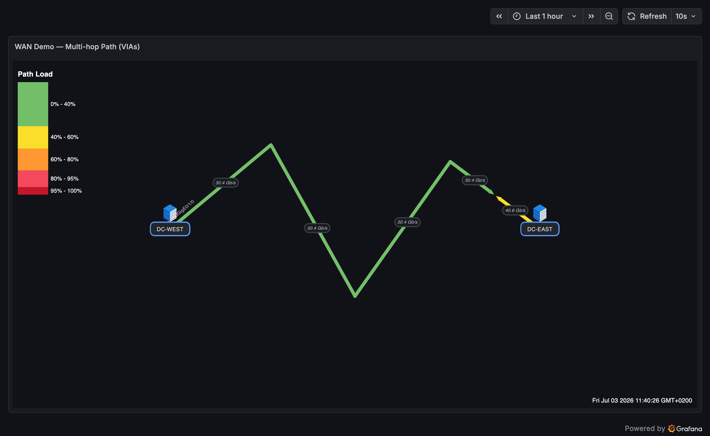

1. Create the A and Z nodes and a direct link.
2. In edit mode, **double-click** the link to drop a VIA, then **drag** it to the bend point.
3. Repeat to add more bends. Use **Arrow Meeting Point (%)** to place the direction arrows on the most meaningful segment.
4. **Right-click** any VIA to remove it later.

**Demo:** *WAN Demo — Multi-hop Path (VIAs)* — one DC interconnect routed through three VIA points; the A-side value rides the first segment and the Z-side value the last, exactly as VIA editing produces.

---

## 6. Device health overview (status coloring)

**Goal:** at-a-glance device health without reading numbers.

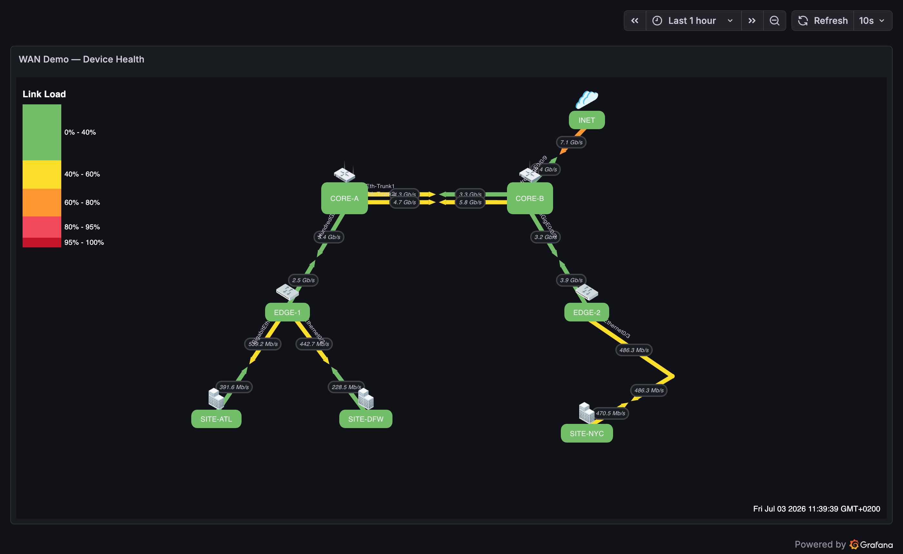

1. For each node, open **Status** and set a **Query** (e.g. `up`, CPU %, temperature).
2. Add **Threshold Mappings** (`value ≥ threshold → color`) and pick a **Color Target** (Border / Background / Both).
3. Optionally add **node Tooltip** metrics (latency, packet loss, CPU) so hovering shows the detail behind the color.

**Demo:** *WAN Demo — Device Health* — every device is colored by packet-loss mappings (green &lt;1%, orange 1–50%, red above); hover any node for its latency/loss tooltip.

---

## 7. Parallel links between the same nodes

**Goal:** show a LAG/port-channel or redundant paths as separate lines.

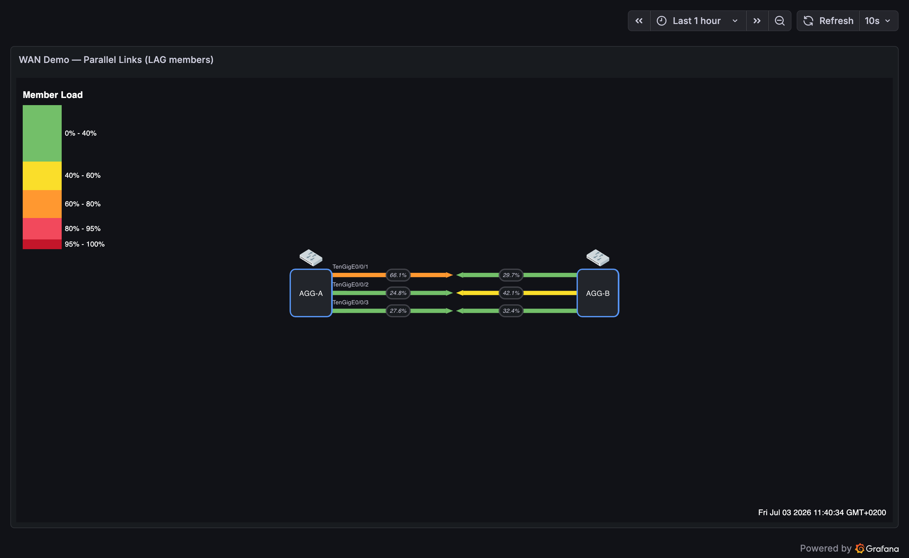

1. Add multiple links between the same two nodes.
2. Give each a different **Link Offset (parallel links)** value (e.g. `-8`, `0`, `+8`) so they spread apart.
3. Set each link's own query so the members are individually visible.

**Demo:** *WAN Demo — Parallel Links (LAG members)* — a three-member LAG with per-member queries, port labels, and utilization percentages; unequal hashing shows one member running hot.

---

## 8. Clickable drill-down map

**Goal:** click a device to open its detailed dashboard.

1. Give each node a **Dashboard Link** (e.g. `/d/abc/switch-detail?var-host=$host`).
2. Use `${var}` template variables in labels, queries, and links for dynamic, reusable maps.
3. In view mode, clicking the node navigates to the target (safely, in a new tab by default).

**Demo:** the demo dashboards form a drill-down chain — *Global Backbone* → click `NYC` → *WAN Utilization* → click a `SITE` → *Building Floor Plan* → click `RACK1-TOR` → *Rack Port Status*.

---

## 9. Global backbone on a world map

**Goal:** intercontinental links (e.g. USA ↔ Europe ↔ Middle East) drawn over real geography.

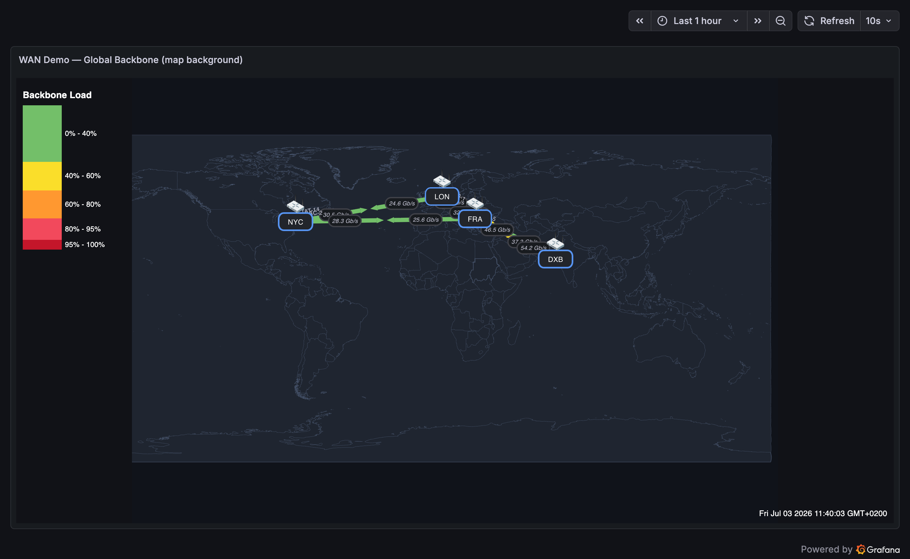

!!! tip "Background image hosting"
    The background is a **URL** — any `http://` or `https://` link works, or drop the file in Grafana's `public/` folder and reference it as `public/img/<name>` (air-gap friendly). `data:` URLs are rejected. Details: [Panel Options → Background](panel-options.md#background).

1. Use a world-map image as the **Background** (public-domain equirectangular SVGs are available on [Wikimedia Commons](https://commons.wikimedia.org/wiki/Category:SVG_blank_maps_of_the_world)); set **Image Fit** to `contain` and enable **Move With Map**.
2. Place a node per PoP/city at its location on the map; the bundled **Country Flags** icon set (ISO two-letter codes) marks each PoP's country.
3. Add the submarine/backbone links between them with per-direction queries and capacities; use **Port Labels** for the cable/system names.

**Demo:** *WAN Demo — Global Backbone (map background)* — NYC, London, Frankfurt, and Dubai over a recolored public-domain world map; clicking `NYC` drills into the regional WAN.

---

## 10. Rack / switch port status board

**Goal:** a faceplate-style board showing every switch port's status at a glance.

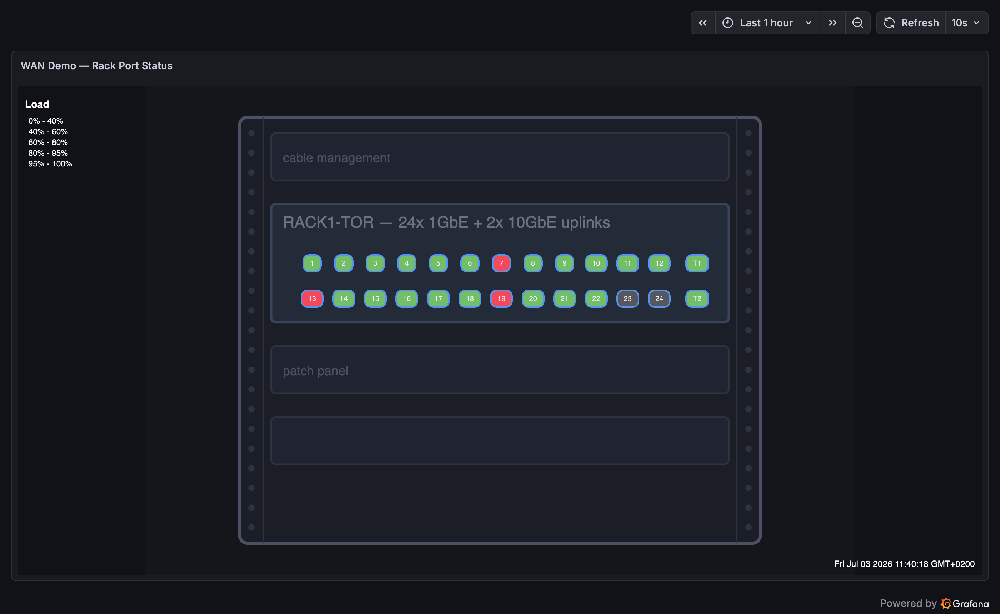

!!! tip "Background image hosting"
    The background is a **URL** — any `http://` or `https://` link works, or drop the file in Grafana's `public/` folder and reference it as `public/img/<name>` (air-gap friendly). `data:` URLs are rejected. Details: [Panel Options → Background](panel-options.md#background).

1. Use a rack/faceplate drawing as the **Background** image.
2. Add one small node per port (label = port number) positioned over the faceplate; no links needed.
3. Set each node's **Status Query** to that port's status series and add **Threshold Mappings** — e.g. `0 → red` (down), `1 → green` (up), `2 → gray` (admin-disabled) — with **Color Target = Background**.

**Demo:** *WAN Demo — Rack Port Status* — 24 access ports plus two 10G uplinks; ports 7/19 are hard down, port 13 flaps every ~5 minutes, 23/24 are admin-disabled.

---

## 11. Rack cabling & power redundancy (multi-device rear view)

**Goal:** one rack's rear elevation — router, firewall, switches, servers — with the actual cable runs between ports **and** the A/B power feeds, so a failed feed or unpatched port is visible at a glance.

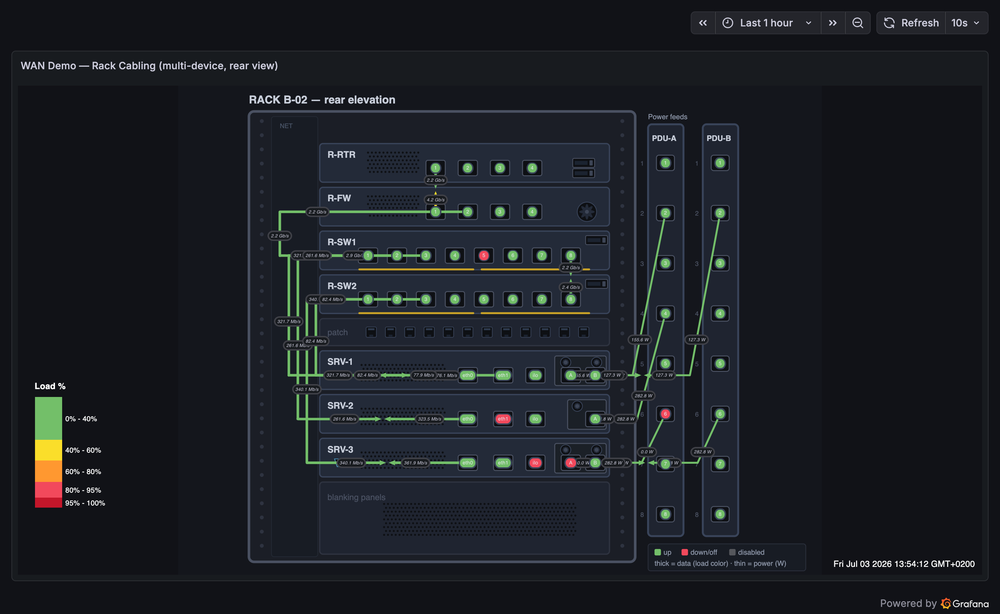

!!! tip "Background image hosting"
    The background is a **URL** — any `http://` or `https://` link works, or drop the file in Grafana's `public/` folder and reference it as `public/img/<name>` (air-gap friendly). `data:` URLs are rejected. Details: [Panel Options → Background](panel-options.md#background).

1. Draw the rack rear elevation (device faceplates, cable channels, PDU strips) as the **Background** image with **Move With Map** enabled.
2. Add one small node per port/NIC/PSU-inlet/PDU-outlet, placed over the drawn openings, each with a **Status Query** and threshold mappings (`0 → red`, `1 → green`, `2 → gray`).
3. Draw each network cable as a link between the two port nodes it patches, routed through the cable channel with VIAs; give each cable its live traffic query.
4. Draw power cables from PDU outlets to PSU inlets with the PDU outlet as the **A side** so the arrows lead feed → server; set **Units** to `watt` and use each PSU's **per-feed** power-draw series on both sides of its cable (e.g. `power{feed="A"}` on the A-feed cable, `{feed="B"}` on the B-feed cable) — that way a dead outlet shows 0 W on its own cable while the surviving feed carries the full draw.
5. Mix dual- and single-supply servers as your rack really is — a dual-fed server survives a dead outlet (its full draw shifts to the B feed and the wattage labels show it); a single-supply server visibly does not have that safety net.

!!! note "Where power metrics come from"
    Smart/metered PDUs (APC, Raritan, Vertiv, …) expose per-outlet state, voltage, current, and power over **SNMP** — scrape them with the Prometheus `snmp_exporter`. If your PDU is dumb (no metrics), get the wattage from the **server side** instead: BMC interfaces via `ipmi_exporter` or Redfish (iDRAC/iLO), or the OS's power sensors via `node_exporter`'s hwmon collectors. The map doesn't care which — it just needs one series per feed.

**Demo:** *WAN Demo — Rack Cabling (multi-device, rear view)* — SW1 port 5 down, SRV-2's standby NIC down, and SRV-3's A feed plugged into PDU-A's dead outlet 6: its A cable reads 0 W while the B feed carries the full draw.

---

## 12. Dense-map readability & interaction

**Goal:** keep a busy map (dozens of cables, ports, and labels) readable and explorable — highlight what you're looking at, cut label clutter, and explain your colors on the map itself. *Requires plugin 1.5.12+.*

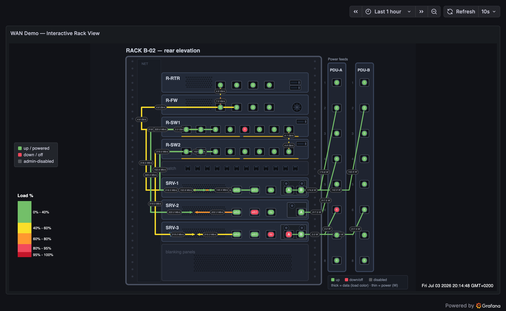

1. **Panel Options → Hover Highlight** — hovering a link keeps its whole path (including every VIA segment) at full opacity and fades all other links and value labels, so a single cable can be traced through the densest map:

    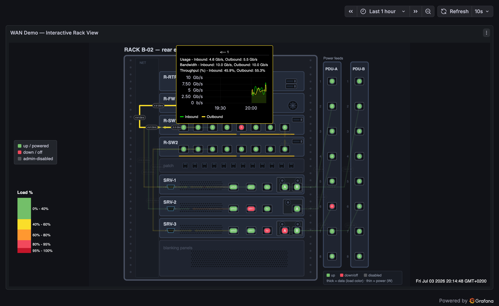

2. **Panel Options → Label Collision Avoidance** — overlapping value labels nudge themselves apart along their own links automatically, replacing hand-tuned label offsets.
3. **Panel Options → Hide Labels When Zoomed Out** — value labels disappear once you zoom out past the configured number of scroll steps and return as you zoom in, keeping the overview clean.
4. **Panel Options → Status Legend** — a built-in legend with your own color+label rows (visible top-left in the screenshots), positioned in panel percent coordinates.
5. **Per link: Single Direction (A → Z)** — flows that physically go one way (power feeds, one-way replication) render as one full-length line with a single arrow into the destination and one value label, instead of the two-sided default.
6. **Per node: Label Font Size / Bold** (under the node's Advanced section) — emphasize important labels (here the PSU inlet `A`/`B` markers) while structural labels stay muted.
7. **Panel Options → [Layers](panel-options.md#layers-hide-what-you-dont-need-right-now)** — when a map carries more text than any one question needs, switch a whole category off: node labels, value labels, or port labels. The configuration stays put; only the drawing changes, so the same dashboard can be a traffic view, a cabling view, and a status wall in turn.

    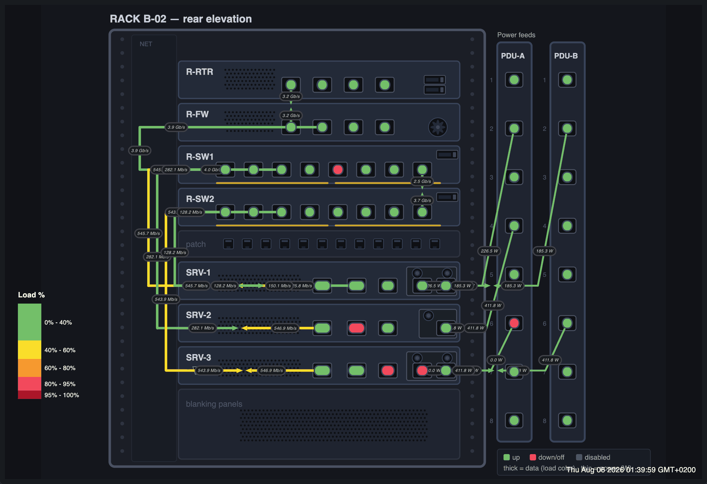

**Demo:** *WAN Demo — Interactive Rack View* — the rack-cabling topology with the first six features enabled: hover any cable to trace it, note the one-way power feeds carrying live wattage into each PSU inlet, and zoom out two steps to watch the labels declutter. *WAN Demo — Layer Visibility* is the same rack deliberately over-labelled, for practising the layer switches.

---

## 13. Animated traffic flow (moving dots)

**Goal:** make traffic *direction* and *intensity* readable at a glance — a link streams dots the way it's carrying traffic, faster and denser as it fills, while a down link visibly stops. *Requires plugin 1.6.0+.*

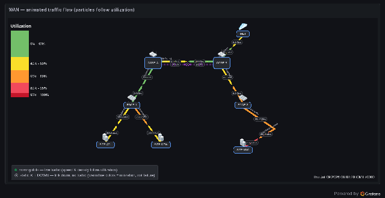

1. **Panel Options → Animation → Enable Traffic Animation** — the master switch (off by default).
2. Make sure each animated link has a **side query** and a **bandwidth** (fixed or query) — animation reuses the values that already color the link; **no extra queries are needed**. Utilization = value ÷ bandwidth drives dot **speed** (`20 + √u·100` px/s) and **density** (`1 + round(u·7)` dots); dot color inherits the link's threshold color.
3. **Per link → Traffic Animation** — leave *Inherit* to follow the panel switch, or set *Enabled* to spotlight one flow / *Disabled* to keep a link static.
4. Add a **Status Query** so a failed link swaps its dots for static **✕ badges** and reads **DOWN** — traffic can't flow on a broken link.
5. Safety is built in: reduced-motion is honored, edit-mode pauses, and **Max Animated Links** caps large maps. Dots are native SVG animation (compositor-only) so the panel never re-renders per frame.

This is a **visualization of metrics you already query — not packet capture**. See the full reference (SNMP/Prometheus data flow, PromQL, timeline behavior, accessibility) in [Traffic Animation](animation.md).

### It reacts to real data, not a canned animation

The dots, colors, and down-state all follow the live time series. In the demo, forcing the operational status of the **CORE-A ↔ EDGE-1** link to `0` (a real interface-down event) makes the plugin drop its dots, dash the line, blink it, stamp both ends **DOWN**, and draw static ✕ badges — while every healthy link keeps flowing. Restore the feed and it animates again on the next scrape.

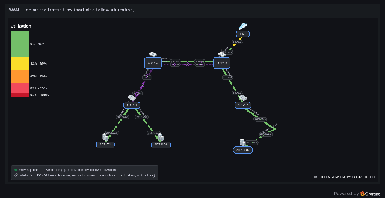

### Data source setup (Prometheus)

The demo dashboard is fed by the [testing stack](https://github.com/allamiro/grafana-network-weathermap-ng/tree/main/testing#readme): a small exporter simulates SNMP interface counters and operational status, Prometheus scrapes them, and the panel binds the resulting series. This is the same shape as a production SNMP path — swap the simulator for `snmp_exporter`:

```
  Network device (switch / router / firewall)
     │  interface counters + ifOperStatus  (SNMP)
     ▼
  snmp_exporter (if_mib)          ← demo: a metrics exporter simulating the same series
     │  /metrics  (wm_link_bps, wm_link_status …)
     ▼
  Prometheus  ── scrape ──▶ stores the time series
     │  PromQL:  rate(ifHCOutOctets[2m]) * 8   /   ifOperStatus
     ▼
  Grafana query (per link side + status)
     │  display name = legend
     ▼
  Network Weathermap NG
     • A/Z side value → dot direction, speed, density
     • bandwidth      → utilization → color + dot count
     • status query   → down: dashed line, DOWN, static ✕
```

Bind it in the link editor: **A/Z Side Query** = the direction's bits/sec, **A/Z Bandwidth** = the interface capacity, **Status Query** = the operational status (`wm_link_status{link="…"}`, or `ifOperStatus{…}` in production). See [Data Sources → Prometheus](datasources.md#prometheus) for the query/legend details.

**Demo:** *WAN Demo — Animated Traffic Flow* — low/medium/high/bidirectional/idle links plus a permanently-down trunk showing ✕ badges next to an animated one, with the built-in legend explaining the glyphs.

---

## Tips that apply everywhere

- **Template variables** (`$var`, `${var}`) are resolved at draw time in labels, queries, status queries, dashboard links, and bandwidth queries — build one panel that serves many sites.
- **Export SVG/JSON** from the Export section to share diagrams or move a map between panels.
- Keep series **display names unique and readable** — that's how weathermap matches queries to links/nodes.
