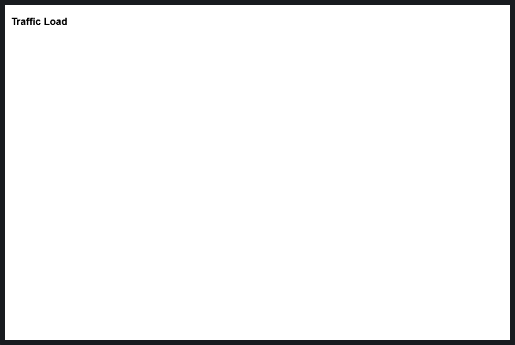
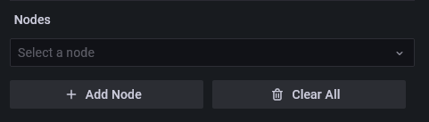
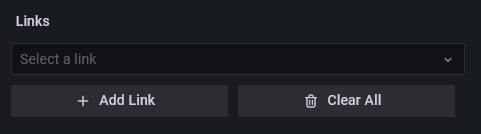
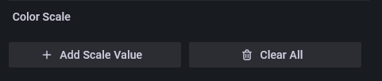

<center></center>

<center>
# Network Weathermap NG
</center>

<center>
A modernized, actively maintained network weathermap panel plugin for Grafana 11+.<br>
Maintained by <a href="https://github.com/allamiro">Tamir Suliman</a> — Plugin ID: <code>tamirsuliman-weathermap-panel</code>
</center>

---

## 📖 Documentation

New here? Start with the step-by-step guide:

- **[Getting Started](guide/getting-started.md)** — from an empty panel to a live traffic map in ~10 minutes
- **[Nodes (Devices)](guide/nodes.md)** — labels, icons, status coloring, node tooltips, dashboard links
- **[Links](guide/links.md)** — queries & bandwidth, units, direction labels, port labels, parallel links, VIAs
- **[Panel Options](guide/panel-options.md)** — background image, value display modes, timeline slider, color scale, tooltips
- **[Interactions & Editing](guide/interactions.md)** — pan/zoom/select on Linux, Windows & macOS; VIA editing; export
- **[Use Cases](guide/use-cases.md)** — capacity planning, incident retros, floor plans, multi-hop paths, and more

---

## About This Fork

This plugin is a continuation of the original [knightss27/grafana-network-weathermap](https://github.com/knightss27/grafana-network-weathermap), which was archived in 2023. What began as a compatibility rescue — keeping a much-loved panel working on modern Grafana — has since grown into an actively maintained project with new capabilities, a full documentation site, a hardened core, and runnable demos. This page is a short tour of where the fork stands today.

### What's new since the fork

The panel does considerably more than the archived original, and every capability below is driven entirely by the metrics you already query — no extra agents, no packet capture.

- **Live traffic animation** — links animate moving dots whose speed and density track real utilization, with a down-link ✕ badge. See the [Traffic Animation guide](guide/animation.md).
- **BGP neighbor status maps** — turn session state into a live map, with fleet and detail dashboards and an SNMP/gNMI collection kit. See the [BGP guide](guide/bgp.md).
- **Timeline / incident replay** — scrub back through history and watch link utilization *and* node status replay step by step.
- **View-mode zoom & pan** — an opt-in setting that lets dashboard viewers zoom and pan without opening the editor.
- **Faceplate & rack generators** — one-click **Generate Port Grid** (switch faceplates, patch panels, PDU strips, blade chassis) and **Generate Rack Elevation** (devices laid out by rack unit) build whole port boards as editable nodes in a single step.
- **Richer nodes & labels** — larger node sizing, scalable font color with an optional background box, and per-side port-label positioning to keep labels clear of icons and parallel links.
- **1064 bundled icons across 12 sets** — networking, cloud, vendors, platforms, databases, country flags and more, all served by the plugin itself (air-gap friendly). Browse the [Icon Reference](icons.md).
- **Runnable demos** — a Docker demo stack provisions every scenario (WAN utilization, incident replay, rack boards, the world-map backbone) against Prometheus, InfluxDB, Elasticsearch, and Zabbix. Explore them in the [Use Cases guide](guide/use-cases.md).
- **Dashboard backup/restore utility** — a dependency-free tool to snapshot your existing Grafana dashboards, queries, and data sources before installing or upgrading.

### Documentation

The fork ships this full documentation site — a step-by-step [Getting Started](guide/getting-started.md) tutorial, deep-dive guides for [Nodes](guide/nodes.md), [Links](guide/links.md), [Panel Options](guide/panel-options.md), and [Interactions & Editing](guide/interactions.md), feature guides for [Traffic Animation](guide/animation.md) and [BGP Neighbor Status](guide/bgp.md), a [Data Sources](guide/datasources.md) reference with per-source notes, a gallery of [Use Cases](guide/use-cases.md), the [Icon Reference](icons.md), and an [FAQ](faq.md).

### Reliability & fixes

Reliability is treated as a feature. The panel is tested against hostile input — malformed saved options, links pointing at deleted nodes, empty data frames — so it renders instead of crashing, and the editor state is deep-frozen in tests so accidental mutation fails CI. Playwright end-to-end suites run on real Grafana from the declared minimum through the latest release. Along the way the fork has fixed data-source binding across Prometheus, InfluxDB, Elasticsearch, and Zabbix (wide-frame value binding, Zabbix alignment and trends), corrected link gradient rendering to the arrow tips, and stays on top of dependency security advisories.

### Under the hood

The original was rebuilt for modern Grafana: the plugin ID is now `tamirsuliman-weathermap-panel`, the `@grafana/*` SDK is updated and verified from **Grafana 11 through 13** (requires **11.0.0+**), React moved 17 → 18, styling migrated from the deprecated `stylesFactory` to `useStyles2` + `@emotion/css`, all `@ts-ignore` overrides were removed, and URLs for dashboard links, icons, and background images are sanitized. Releases are built on Node.js 24, signed and attested, with an API-compatibility matrix and packaging checks on every PR.

Contributions and bug reports are welcome at [github.com/allamiro/grafana-network-weathermap-ng](https://github.com/allamiro/grafana-network-weathermap-ng).

---

## Installation

### Installing on a local Grafana

Requires **Grafana 11.0.0 or later**.

#### Option A — Grafana Marketplace (once approved)

```bash
grafana-cli plugins install tamirsuliman-weathermap-panel
```

The plugin will be installed into your Grafana plugins directory (default `/var/lib/grafana/plugins`). [More on the CLI tool.](https://grafana.com/docs/grafana/latest/administration/cli/#plugins-commands)

#### Option B — Manual install from GitHub release

1. Download the latest ZIP from the [Releases page](https://github.com/allamiro/grafana-network-weathermap-ng/releases/latest/)
2. Extract it into your Grafana plugins directory:

```bash
unzip tamirsuliman-weathermap-panel-*.zip -d /var/lib/grafana/plugins/
```

3. Restart Grafana and enable the plugin under **Administration → Plugins**.


#### 2: Add the Panel to a Dashboard

Installed panels are available immediately in the Dashboards section in your Grafana main menu, and can be added like any other core panel in Grafana.

To see a list of installed panels, click the Plugins item in the main menu. Both core panels and installed panels will appear.

### Testing

For testing with Docker, follow the instructions on the [testing README](https://github.com/allamiro/grafana-network-weathermap-ng/tree/main/testing#readme). This will provide you with an instance to play around with.

---
## Creating a New Weathermap

1. In Grafana, create a new `Empty Panel`.
2. Change the visualisation in the top right corner to `Network Weathermap`.
3. You now have a brand new network weathermap panel! 🎉
4. Learn about weathermap basics below!

---

## On Startup

By default, the panel will start completely blank, looking something like this:



### Adding Nodes

- Make sure you have selected `Edit` on the panel in Grafana.
- On the right hand side, find the `Nodes` editor.

    

- Click `Add Node` to create a new node.
- Nodes have three basic fields:
    - X position (`number`): Node's X position.
    - Y position (`number`): Node's Y position.
    - Label (`string`): The text visible on the node.
- You can then move the node by dragging it with your mouse.

### Adding Links

- Ensure you have at least two nodes.
- On the right hand side, find the `Links` editor.

    

- Click `Add Link` to create a new link.
- Links are split into two sides, `A` and `B`.
- Each side has four central fields:
    - Side (`Node`): The node this side of the link connects to.
    - Query (`Query`): A query representing the current side's throughput in the specified units.
    - Bandwidth # (`number`): A number representing the bandwidth of this side in specified units.
    - Bandwidth Query (`Query`): A query representing the bandwidth of this side in the specified units.
    - Units (`unit`): The units the link expects to recieve its data as. This is used for both the main query and bandwidth. Defaults to `bits/sec (SI)` (`bps`).
- Select `A` and `B` side nodes from their respective dropdowns.

### Adding Data

- The weathermap expects a data frame with two fields, a time and a number.
- You probably want this number in `bits/sec`, unless your links are expecting something else (each link has customizable units, and default units are customizable in the global settings for the panel).
- The weathermap will always choose the most recent data point available. If you want your links graphs to have data, make sure your queries are ranges and not "Instant" queries, as this will mean there is no data to show on each graph.
- Once you have added a query in the panel editor, you can can see all queries and select one from the dropdown in the Query fields of the links.
- See the [FAQ](faq.md) or [Github issues](https://github.com/allamiro/grafana-network-weathermap-ng/issues) if you are having issues adding data (especially Zabbix datasource users).

**PLEASE NOTE:** _Queries with the exact same labels will be considered as such. If you have multiple queries and are unable to select the one that you want, double check to make sure it is labeled uniquely._

### Setting Thresholds

- The weathermap color scale allows you to color links based on their bandwidth usage.
- On the right hand side, find the `Color Scale` editor.
  
- Click `Add Scale Value` to create a new threshold.
- Each threshold has two basic fields:
    - % (`number`): The percent of bandwidth usage at which to _start_ this threshold.
    - Color (`picker`): The color of this threshold, can be any valid CSS `color` chosen or input with the picker.
        - `green` | `#00FF00` | `rgb(0, 255, 0)`
- By default, the scale will fill from the highest threshold to 100%. You can see the scale in the top left of the panel. When updating numerical values, click off of the input when you're finished to allow the scale to update.

### Interacting with the Weathermap

- In editing mode:
    - `Click + Drag` nodes to move them.
    - `Shift + Drag` or hold and drag `Middle Mouse` to move the map.
    - `Scroll` to zoom.
    - `Ctrl + Click` to select/deselect multiple nodes before dragging.
    - `Double Click` to deselect all nodes.
- Outside of editing mode (including read-only users):
    - `Shift + Scroll` to zoom.
    - `Shift + Drag` to move the map.
- Hover over links to see tooltip information.
    - Hold `Shift` while hovering to free up the mouse.
    - Hover over the same link or another to unfreeze the tooltip.